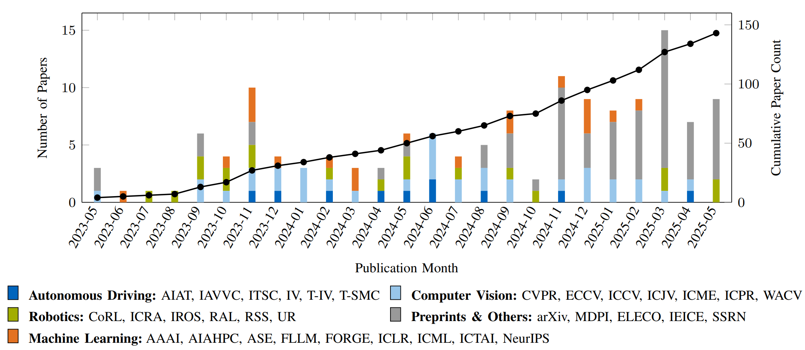
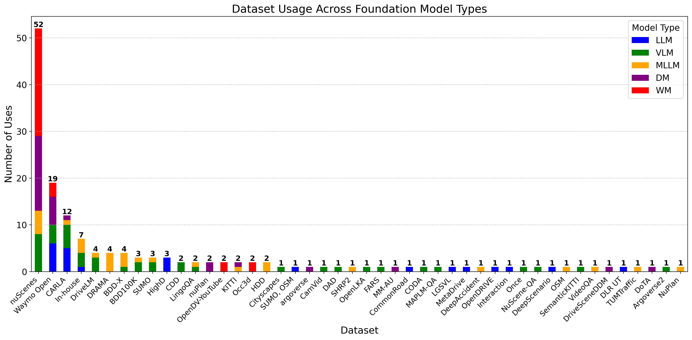
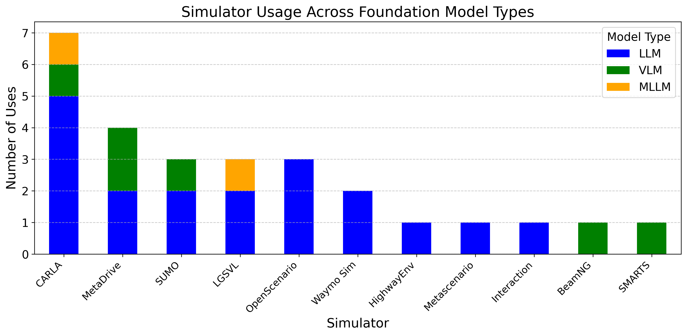

# Foundation Models in Autonomous Driving: A Survey on Scenario Generation and Scenario Analysis :car:
<div align="center">
<a href="https://arxiv.org/pdf/2506.11526"></a>
<a href="https://github.com/TUM-AVS/FM-AD-Survey/stargazers"></a>
<a href="https://github.com/TUM-AVS/FM-AD-Survey/network/members"></a>
<a href="https://github.com/TUM-AVS/FM-AD-Survey/pulls"></a>
<a href="https://github.com/TUM-AVS/FM-AD-Survey/issues"></a>
<a href="https://github.com/TUM-AVS/FM-AD-Survey/blob/main/LICENSE"></a>
</div>

This repository will collect research, implementations, and resources related to **Foundation Models for Scenario Generation and Analysis** in autonomous driving. The repository will be maintained by [TUM-AVS](https://www.mos.ed.tum.de/avs/startseite/) (Professorship of Autonomous Vehicle Systems at Technical University of Munich) and will be continuously updated to track the latest work in the community.

<p align="center">

</p>

## :fire: Updates
- **Dec 2025** – Added **3 new papers** on scenario generation* and **14 new papers** on scenario analysis*. Added new columns: **Hardware and Citation**.
- **Nov 2025** – Added **2 new papers** on scenario analysis*. Added new section: **Useful Resources and Links**.
- Uploaded new version to arXiv. Repository now categorizes **348 papers**:
  - 93 on scenario generation
  - 56 on scenario analysis
  - 58 on datasets
  - 21 on simulators
  - 25 on benchmark challenges
  - 95 on other related topics (e.g., FMs' implementation)
- **Oct 2025** – Added **17 new papers** on scenario generation* and **2 new papers** on scenario analysis*. 
- **Sep 2025** – Added **3 new papers** on scenario generation* and **14 new papers** on scenario analysis*. 
- **Aug 2025** – Added **4 new papers** on scenario generation* and **4 new papers** on scenario analysis*.  
- **Jul 2025** – Added **9 new papers** on scenario generation* and **8 new papers** on scenario analysis*.  
- **Jun 2025** – Released our paper on arXiv. Repository now categorizes **342 papers**:  
  - 93 on scenario generation  
  - 54 on scenario analysis  
  - 55 on datasets  
  - 21 on simulators  
  - 25 on benchmark challenges  
  - 94 on other related topics  
- **May 2025** – Repository initialized.  

## 🤝 &nbsp; Citation
Please visit [Foundation Models in Autonomous Driving: A Survey on Scenario Generation and Scenario Analysis](https://arxiv.org/abs/2506.11526) for more details and comprehensive information. If you find our paper and repo helpful, please consider citing it as follows:

<!-- Complete author list for when ready to publish:
Yuan Gao, Mattia Piccinini, Yuchen Zhang, Dingrui Wang, Korbinian Moller, Roberto Brusnicki, Baha Zarrouki, Alessio Gambi, Jan Frederik Totz, Kai Storms, Steven Peters, Andrea Stocco, Bassam Alrifaee, Marco Pavone and Johannes Betz
-->

```BibTeX
@misc{gao2025foundation,
  title={Foundation Models in Autonomous Driving: A Survey on Scenario Generation and Scenario Analysis},
  author={Yuan Gao, Mattia Piccinini, Yuchen Zhang, Dingrui Wang, Korbinian Moller, Roberto Brusnicki, Baha Zarrouki, Alessio Gambi, Jan Frederik Totz, Kai Storms, Steven Peters, Andrea Stocco, Bassam Alrifaee, Marco Pavone and Johannes Betz,
  journal={TBD},
  year={2025},
  eprint={2506.11526},
  archivePrefix={arXiv},
  primaryClass={cs.RO},
  url={https://arxiv.org/abs/2506.11526}, 
}
```

## :page_with_curl: Introduction
Foundation models are large-scale, pre-trained models that can be adapted to a wide range of downstream tasks. In the context of autonomous driving, foundation models offer a powerful approach to scenario generation and analysis, enabling more comprehensive and realistic testing, validation, and verification of autonomous driving systems. This repository aims to collect and organize research, tools, and resources in this important field.

<p align="center">

</p>

## :chart_with_upwards_trend: Publication Timeline
The following figure shows the evolution of foundation model research in autonomous driving scenario generation and analysis over time:

<p align="center">

</p>

## :mag: Search Methodology
The following list of keywords was used to search this survey's papers in the Google Scholar database. The keywords were entered either individually or in combination with other keywords in the list. The search was conducted until May 2025.

**Keywords:**
- **Foundation Model Types:** Foundation Models, Large Language Models (LLMs), Vision-Language Models (VLMs), Multimodal Large Language Models (MLLMs), Diffusion Models (DMs), World Models (WMs), Generative Models (GMs)
- **Scenario Generation & Analysis:** Scenario Generation, Scenario Simulation, Traffic Simulation, Scenario Testing, Scenario Understanding, Driving Scene Generation, Scene Reasoning, Risk Assessment, Safety-Critical Scenarios, Accident Prediction
- **Application Context:** Autonomous Driving, Self-Driving Vehicles, AV Simulation, Driving Video Generation, Traffic Datasets, Closed-Loop Simulation, Safety Assurance
## 🌟 Large Language Models for Autonomous Driving

<details open>
<summary><strong>Scenario Generation (LLM)</strong></summary>

| Paper | Date | Venue | Code | Hardware |  Citation |
|:------|:-----|:------|:-----|:---------|:---------|
| [TARGET: Automated Scenario Generation from Traffic Rules for Testing Autonomous Vehicles](https://arxiv.org/abs/2305.06018) | 2023-05 | IEEE Transactions on Software Engineering | - |  API&RTX4090 | 24 |
| [Language Conditioned Traffic Generation](https://arxiv.org/abs/2307.07947) | 2023-07 | CoRL 2023 | [GitHub](https://github.com/Ariostgx/lctgen/) | API | 98 |
| [A Generative AI-driven Application: Use of Large Language Models for Traffic Scenario Generation](https://ieeexplore.ieee.org/document/10415934) | 2023-11 | ELECO 2023 | - | API | 15 |
| [ChatGPT-Based Scenario Engineer: A New Framework on Scenario Generation for Trajectory Prediction](https://ieeexplore.ieee.org/document/10423819) | 2024-02 | IEEE Transactions on Intelligent Vehicles | - |- | 48 |
| [Enhancing Autonomous Vehicle Training with Language Model Integration and Critical Scenario Generation](https://arxiv.org/abs/2404.08570) | 2024-04 | arXiv | [GitHub](https://github.com/zachtian/CRITICAL) | A6000 | 24 |
| [LLMScenario: Large Language Model Driven Scenario Generation](https://ieeexplore.ieee.org/document/10529537) | 2024-05 | IEEE Transactions on Systems, Man, and Cybernetics: Systems | - | API |  69 |
| [Automatic Generation Method for Autonomous Driving Simulation Scenarios Based on Large Language Model](https://link.springer.com/chapter/10.1007/978-981-96-3977-9_10) | 2024-05 | AIAT 2024 | - | API | 2 |
| [ChatScene: Knowledge-Enabled Safety-Critical Scenario Generation for Autonomous Vehicles](https://ieeexplore.ieee.org/stamp/stamp.jsp?arnumber=10655362) | 2024-05 | CVPR 2024 | [GitHub](https://github.com/javyduck/ChatScene) | API |113 |
| [Editable scene simulation for autonomous driving via collaborative llm-agents](https://ieeexplore.ieee.org/document/10656629) | 2024-06 | CVPR 2024 | [GitHub](https://github.com/yifanlu0227/ChatSim) | API |130 |
| [Chat2Scenario: Scenario Extraction From Dataset Through Utilization of Large Language Model](https://ieeexplore.ieee.org/document/10588843) | 2024-06 | IV 2024 | [GitHub](https://github.com/ftgTUGraz/Chat2Scenario) | - |15 |
| [SoVAR: Building Generalizable Scenarios from Accident Reports for Autonomous Driving Testing](https://arxiv.org/abs/2409.08081) | 2024-09 | ASE 2024 | - | RTX4070 | 29 |
| [LeGEND: A Top-Down Approach to Scenario Generation of Autonomous Driving Systems Assisted by Large Language Models](https://arxiv.org/abs/2409.10066) | 2024-09 | ASE 2024 | [GitHub](https://github.com/MayDGT/LeGEND) | RTX3090 | 32 |
| [Traffic Scene Generation from Natural Language Description for Autonomous Vehicles with Large Language Model](https://arxiv.org/abs/2409.09575) | 2024-09 | arXiv | [GitHub](https://github.com/basiclab/TTSG) | API | 18 |
| [Promptable Closed-loop Traffic Simulation](https://arxiv.org/abs/2409.05863) | 2024-09 | CoRL 2024 | [GitHub](https://ariostgx.github.io/ProSim/) | A100 | 16 |
| [Multimodal Large Language Model Driven Scenario Testing for Autonomous Vehicles](https://arxiv.org/abs/2409.06450) | 2024-09 | Automotive Innovation | - | - | 26 |
| [LLM-Driven Testing for Autonomous Driving Scenarios](https://ieeexplore.ieee.org/document/10852505) | 2024-11 | FLLM 2024 | - | API& T4 | 15 |
| [ChatSUMO: Large Language Model for Automating Traffic Scenario Generation in Simulation of Urban MObility](https://ieeexplore.ieee.org/document/10770822) | 2024-11 | IEEE Transactions on Intelligent Vehicles | - | RTX4090 |  54 |
| [Generating Out-Of-Distribution Scenarios Using Language Models](https://arxiv.org/abs/2411.16554) | 2024-11 | arXiv | - | API | 13 |
| [Generating Traffic Scenarios via In-Context Learning to Learn Better Motion Planner](https://arxiv.org/abs/2412.18086) | 2024-12 | AAAI 2025 Oral | [GitHub](https://ezharjan.github.io/AutoSceneGen/) | RTX 3090 | 3 |
| [LLM-attacker: Enhancing Closed-loop Adversarial Scenario Generation for Autonomous Driving with Large Language Models](https://arxiv.org/abs/2501.15850) | 2025-01 | TITS 2025 | - |RTX 4000 | 25 |
| [ML-SceGen: A Multi-level Scenario Generation Framework](https://arxiv.org/abs/2501.10782) | 2025-01 | arXiv | - | RTX 4090 |  0 |
| [From Words to Collisions: LLM-Guided Evaluation and Adversarial Generation of Safety-Critical Driving Scenarios](https://arxiv.org/abs/2502.02145) | 2025-02 | ITSC 2025 | [GitHub](https://github.com/TUM-AVS/From-Words-to-Collisions) | API | 3 |
| [CurricuVLM: Towards Safe Autonomous Driving via Personalized Safety-Critical Curriculum Learning with Vision-Language Models](https://arxiv.org/abs/2502.15119) | 2025-02 | arXiv | [GitHub](https://zihaosheng.github.io/CurricuVLM/) | - | 10 |
| [Text2Scenario: Text-Driven Scenario Generation for Autonomous Driving Test](https://arxiv.org/abs/2503.02911) | 2025-03 | arXiv | [GitHub](https://caixxuan.github.io/Text2Scenario.GitHub.io/) | - | 14 |
| [Enhancing Autonomous Driving Safety with Collision Scenario Integration](https://arxiv.org/abs/2503.03957) | 2025-03 | arXiv | - | 8xV100 |  6 |
| [Seeking to Collide: Online Safety-Critical Scenario Generation for Autonomous Driving with Retrieval Augmented Large Language Models](https://arxiv.org/abs/2505.00972) | 2025-05 | ITSC 2025 | - | API | 5 |
| [From Failures to Fixes: LLM-Driven Scenario Repair for Self-Evolving Autonomous Driving](https://arxiv.org/abs/2505.22067) | 2025-05 | arXiv | - | RTX4090 | 0 |
| [AGENTS-LLM: Augmentative GENeration of Challenging Traffic Scenarios with an Agentic LLM Framework](https://www.arxiv.org/abs/2507.13729v1) | 2025-07 | arXiv | - | API | 1 |
| [LLM-based Realistic Safety-Critical Driving Video Generation](https://www.arxiv.org/abs/2507.01264v1) | 2025-07 | arXiv | - | RTX4090 | 1 |
| [Adversarial Generation and Collaborative Evolution of Safety-Critical Scenarios for Autonomous Vehicles](https://arxiv.org/abs/2508.14527) | 2025-08 | arXiv | [GitHub](https://scenge.github.io/) | 2xRTX4090 | 0 |
| [LLM-based Human-like Traffic Simulation for Self-driving Tests](https://arxiv.org/abs/2508.16962) | 2025-08 | arXiv | - | API& A800| 0 |
| [Conversational Code Generation: a Case Study of Designing a Dialogue System for Generating Driving Scenarios for Testing Autonomous Vehicles](https://arxiv.org/abs/2410.09829) | 2025-09 | GeCoIn 2025 | - | A6000 | 3 |
| [Txt2Sce: Scenario Generation for Autonomous Driving System Testing Based on Textual Reports](https://arxiv.org/abs/2509.02150) | 2025-09 | arXiv | - | RTX3070Ti | 1 |
| [LLM‑Based Semantic Modeling & Cooperative Evolutionary Fuzzing](https://conf.researchr.org/details/apsec-2025/apsec-2025-papers/53/LLM-Based-Semantic-Modeling-and-Cooperative-Evolutionary-Fuzzing-for-Traffic-Violatio) | 2025-09 | APSEC 2025 | - | - | 0 |
| [LinguaSim: Interactive Multi-Vehicle Testing Scenario Generation via Natural Language Instruction Based on Large Language Models](https://arxiv.org/abs/2510.08046) | 2025-10 | IEEE ITSC 2025 | - | - | 0 |
</details>

<details open>
<summary><strong>Scenario Analysis (LLM)</strong></summary>

| Paper | Date | Venue | Code | Hardware |  Citation |
|:------|:-----|:------|:-----|:---------|:---------|
| [Semantic Anomaly Detection with Large Language Models](https://arxiv.org/abs/2305.11307) | 2023-09 | Autonomous Robots | - | - | 131 |
| [Reality Bites: Assessing the Realism of Driving Scenarios with Large Language Models](https://arxiv.org/abs/2403.09906) | 2024-03 | IEEE/ACM First International Conference on AI Foundation Models and Software Engineering (Forge) | [GitHub](https://github.com/Simula-COMPLEX/RealityBites) | API |  22 |
| [Driving with LLMs: Fusing Object-Level Vector Modality for Explainable Autonomous Driving](https://ieeexplore.ieee.org/abstract/document/10611018) | 2024-05 | ICRA 2024 | [GitHub](https://github.com/wayveai/Driving-with-LLMs) | API |  340 |
| [SenseRAG: Constructing Environmental Knowledge Bases with Proactive Querying for LLM-Based Autonomous Driving](https://arxiv.org/abs/2501.03535) | 2025-01 | 2025 WACVW | - | API |  9 |
| [From Words to Collisions: LLM-Guided Evaluation and Adversarial Generation of Safety-Critical Driving Scenarios](https://arxiv.org/abs/2502.02145) | 2025-02 | ITSC 2025 | [GitHub](https://github.com/TUM-AVS/From-Words-to-Collisions) | API | 3 |
| [A Comprehensive LLM-powered Framework for Driving Intelligence Evaluation](https://arxiv.org/abs/2503.05164) | 2025-03 | ICRA 2025 | [GitHub](https://github.com/AIR-DISCOVER/Driving-Intellenge-Evaluation-Framework) | API |  7 |
| [Understanding Driving Risks using Large Language Models: Toward Elderly Driver Assessment](https://arxiv.org/abs/2507.08367) | 2025-07 | arXiv| - | - |  0 |
| [Collision risk prediction and takeover requirements assessment based on radar-video integrated sensors data: A system framework based on LLM](https://www.sciencedirect.com/science/article/pii/S0001457525001277) | 2025-08 | Accident Analysis & Prevention | - |  API&RTX4090 | 7 |
</details>

## 🌟 Vision-Language Models for Autonomous Driving

<details open>
<summary><strong>Scenario Generation (VLM)</strong></summary>

| Paper | Date | Venue | Code | Hardware |  Citation |
|:------|:-----|:------|:-----|:---------|:---------|
| [WEDGE: A multi-weather autonomous driving dataset built from generative vision-language models](https://arxiv.org/pdf/2305.07528) | 2023-05 | CVPR workshop 2023 | [GitHub](https://github.com/Infernolia/WEDGE)  | API | 63 |
| [DriveGenVLM: Real-world Video Generation for Vision Language Model based Autonomous Driving](https://ieeexplore.ieee.org/abstract/document/10786438) | 2024-08 | IAVVC 2024 | - | L4 |13|
| [From Dashcam Videos to Driving Simulations: Stress Testing Automated Vehicles against Rare Events](https://arxiv.org/abs/2411.16027) | 2024-11 | arXiv | - | API |7 |
| [From Accidents to Insights: Leveraging Multimodal Data for Scenario-Driven ADS Testing](https://arxiv.org/abs/2502.02025) | 2025-02 | arXiv | - | API |4 |
| [CurricuVLM: Towards Safe Autonomous Driving via Personalized Safety-Critical Curriculum Learning with Vision-Language Models](https://arxiv.org/abs/2502.15119) | 2025-02 | arXiv | [GitHub](https://zihaosheng.github.io/CurricuVLM/) | - |8 |
| [CrashAgent: Crash Scenario Generation via Multi-modal Reasoning](https://www.arxiv.org/abs/2505.18341) | 2025-05 | arXiv | - | API |2 |
| [BENCH2ADVLM: A Closed-Loop Benchmark for Vision-language Models in Autonomous Driving](https://www.arxiv.org/abs/2508.02028v2) | 2025-08 | arXiv | - | 8×A800 |2 |
| [Vision Language Model-based Testing of Industrial Autonomous Mobile Robots](https://www.arxiv.org/abs/2508.02338v1) | 2025-08 | arXiv | - | - |1 |
</details>

<details open>
<summary><strong>Scenario Analysis (VLM)</strong></summary>

| Paper | Date | Venue | Code | Hardware |  Citation |
|:------|:-----|:------|:-----|:---------|:---------|
| [Unsupervised 3D Perception with 2D Vision-Language Distillation for Autonomous Driving](https://arxiv.org/abs/2309.14491) | 2023-09 | ICCV 2023 | - | - | 49 |
| [OpenAnnotate3D: Open-Vocabulary Auto-Labeling System for Multi-modal 3D Data](https://arxiv.org/abs/2310.13398) | 2023-10 | ICRA 2024 | [GitHub](https://github.com/Fudan-ProjectTitan/OpenAnnotate3D) | API&RTX4090| 19 |
| [On the Road with GPT-4V(ision): Early Explorations of Visual-Language Model on Autonomous Driving](https://arxiv.org/abs/2311.05332) | 2023-11 | ICIL 2024 Workshop on Large Language Models for Agents | [GitHub](https://github.com/PJLab-ADG/GPT4V-AD-Exploration) | - | 105 |
| [Talk2BEV: Language-enhanced Bird's-eye View Maps for Autonomous Driving](https://arxiv.org/abs/2310.02251) | 2023-11 | ICRA 2024 | [GitHub](https://github.com/llmbev/talk2bev) | A100 | 114 |
| [LLM Multimodal Traffic Accident Forecasting](https://www.mdpi.com/1424-8220/23/22/9225) | 2023-11 | Sensors 2023 MDPI | - | - |  98 |
| [NuScenes-MQA: Integrated Evaluation of Captions and QA for Autonomous Driving Datasets using Markup Annotations](https://ieeexplore.ieee.org/abstract/document/10495633) | 2024-01 | WACVW LLVM-AD 2024 | [GitHub](https://github.com/turingmotors/NuScenes-MQA) |  8xA100 |35 |
| [Is it safe to cross? Interpretable Risk Assessment with GPT-4V for Safety-Aware Street Crossing](https://ieeexplore.ieee.org/stamp/stamp.jsp?arnumber=10597464) | 2024-02 | UR 2024 | - |  - |22 |
| [Multi-Frame, Lightweight & Efficient Vision-Language Models for Question Answering in Autonomous Driving](https://arxiv.org/abs/2403.19838) | 2024-03 | VLADR 2024 | [GitHub](https://github.com/akshaygopalkr/EM-VLM4AD) | RTX 3090Ti&V100  | 55 |
| [LATTE: A Real-time Lightweight Attention-based Traffic Accident Anticipation Engine](https://arxiv.org/abs/2504.04103) | 2024-04 | Information Fusion (Elsevier) | - | RTX4080  | 3 |
| [OmniDrive: A Holistic Vision-Language Dataset for Autonomous Driving with Counterfactual Reasoning](https://arxiv.org/abs/2405.01533) | 2024-05 | CVPR 2025 | [GitHub](https://github.com/NVlabs/OmniDrive) | - |47 |
| [Reason2Drive: Towards Interpretable and Chain-based Reasoning for Autonomous Driving](https://arxiv.org/abs/2312.03661) | 2024-06 | ECCV 2024 | [GitHub](https://github.com/fudan-zvg/reason2drive) | 8xV100 |118 |
| [ConnectGPT: Connect Large Language Models with Connected and Automated Vehicles](https://ieeexplore.ieee.org/document/10588835) | 2024-06 | IV 2024 | - | - |21 |
| [SimpleLLM4AD: An End-to-End Vision-Language Model with Graph Visual Question Answering for Autonomous Driving](https://arxiv.org/abs/2407.21293) | 2024-07 | arXiv | - |  - |14 |
| [Large Language Models Powered Context-aware Motion Prediction in Autonomous Driving](https://arxiv.org/abs/2403.11057) | 2024-07 | IROS 2024 | [GitHub](https://github.com/AIR-DISCOVER/LLM-Augmented-MTR) | API | 13 |
| [DriveGenVLM: Real-world Video Generation for Vision Language Model based Autonomous Driving](https://ieeexplore.ieee.org/abstract/document/10786438) | 2024-08 | IAVVC 2024 | - |  L4  |13 |
| [V2X-VLM: End-to-End V2X Cooperative Autonomous Driving Through Large Vision-Language Models](https://arxiv.org/abs/2408.09251) | 2024-08 | arXiv | - | RTX4090 | 46 |
| [Think-Driver: From Driving-Scene Understanding to Decision-Making with Vision Language Models](https://mllmav.github.io/papers/Think-Driver:%20From%20Driving-Scene%20Understanding%20to%20Decision-Making%20with%20Vision%20Language%20Models.pdf) | 2024-09 | ECCV 2024 Workshop | - | 4xRTX4090 | 4 |
| [VLM-Auto: VLM-based Autonomous Driving Assistant with Human-like Behavior and Understanding for Complex Road Scenes](https://arxiv.org/abs/2405.05885) | 2024-10 | FLLM 2024 | [GitHub](https://github.com/ZionGo6/VLM-Auto) |  RTX4090 |41 |
| [Visual Adversarial Attack on Vision-Language Models for Autonomous Driving](https://arxiv.org/abs/2411.18275) | 2024-11 | arXiv | - |  A800 | 19 |
| [Automated Evaluation of Large Vision-Language Models on Self-driving Corner Cases](https://arxiv.org/abs/2404.10595) | 2024-12 | WACV 2025 | [GitHub](https://coda-dataset.github.io/coda-lm/) | 8xA800 | 33 |
| [SFF Rendering-Based Uncertainty Prediction using VisionLLM](https://openreview.net/forum?id=q8ptjh1pDl) | 2024-12 | AAAI 2025 Workshop LM4Plan | - |  A100 |3 |
| [Are VLMs Ready for Autonomous Driving? An Empirical Study from the Reliability, Data, and Metric Perspectives](https://arxiv.org/abs/2501.04003) | 2025-01 | ICCV 2025 | [GitHub](https://drive-bench.github.io/) |  8xA800 |28 |
| [Enhancing Large Vision Model in Street Scene Semantic Understanding through Leveraging Posterior Optimization Trajectory](https://arxiv.org/abs/2501.01710) | 2025-01 | arXiv | - |  2xRTX4090 |7 |
| [Enhancing Vision-Language Models with Scene Graphs for Traffic Accident Understanding](https://arxiv.org/abs/2407.05910) | 2025-01 | IAVVC 2024 | - |  - |15 |
| [DriveLM: Driving with Graph Visual Question Answering](https://arxiv.org/abs/2312.14150) | 2025-01 | ECCV 2024 | [GitHub](https://github.com/OpenDriveLab/DriveLM) | 8xV100 | 473 |
| [Scenario Understanding of Traffic Scenes Through Large Visual Language Models](https://arxiv.org/pdf/2501.17131) | 2025-01 | WACV 2025 | - | A100 | 7 |
| [INSIGHT: Enhancing Autonomous Driving Safety through Vision-Language Models on Context-Aware Hazard Detection and Edge Case Evaluation](https://www.arxiv.org/abs/2502.00262) | 2025-02 | arXiv | - | A6000 |8 |
| [Evaluating Multimodal Vision-Language Model Prompting Strategies for Visual Question Answering in Road Scene Understanding](https://openaccess.thecvf.com/content/WACV2025W/LLVMAD/html/Keskar_Evaluating_Multimodal_Vision-Language_Model_Prompting_Strategies_for_Visual_Question_Answering_WACVW_2025_paper.html) | 2025-02 | WACV workshop 2025 | - | RTX4090 | 14 |
| [NuGrounding: A Multi-View 3D Visual Grounding Framework in Autonomous Driving](https://arxiv.org/abs/2503.22436) | 2025-03 | arXiv | - | - | 4 |
| [Fine-Grained Evaluation of Large Vision-Language Models in Autonomous Driving](https://arxiv.org/abs/2503.21505) | 2025-03 | ICCV 2025  | [GitHub](https://github.com/Depth2World/VLADBench) | 8xV100 | 10 |
| [AutoDrive-QA- Automated Generation of Multiple-Choice Questions for Autonomous Driving Datasets Using Large Vision-Language Models](https://arxiv.org/abs/2503.15778) | 2025-03 | arXiv | [GitHub](https://github.com/Boshrakh/AutoDrive-QA) |  3xA6000 |4 |
| [DriveLMM-o1: A Step-by-Step Reasoning Dataset and Large Multimodal Model for Driving Scenario Understanding](https://arxiv.org/abs/2503.10621) | 2025-03 | arXiv | [GitHub](https://github.com/ayesha-ishaq/DriveLMM-o1) |  4xA6000 |20 |
| [ORION: A Holistic End-to-End Autonomous Driving Framework by Vision-Language Instructed Action Generation](https://www.arxiv.org/abs/2503.19755) | 2025-03 | arXiv | [GitHub](https://xiaomi-mlab.github.io/Orion/) | 32xA800 | 50 |
| [ChatBEV: A Visual Language Model that Understands BEV Maps](https://www.arxiv.org/abs/2503.13938) | 2025-03 | arXiv | - | - | 2 |
| [Robusto-1 Dataset: Comparing Humans and VLMs on real out-of-distribution Autonomous Driving VQA from Peru](https://www.arxiv.org/abs/2503.07587) | 2025-03 | arXiv | [GitHub](https://huggingface.co/datasets/Artificio/robusto-1/tree/main) | A100&API | 2 |
| [Retrieval-Based Interleaved Visual Chain-of-Thought in Real-World Driving Scenarios](https://www.arxiv.org/abs/2501.04671) | 2025-04 | arXiv | [GitHub](https://vita-epfl.github.io/DrivingVQA/) | 4xA100 | 6 |
| [Vision Foundation Model Embedding-Based Semantic Anomaly Detection](https://arxiv.org/abs/2505.07998) | 2025-05 | ICRA 2025 Workshop | - | - | 3 |
| [OpenLKA: An Open Dataset of Lane Keeping Assist from Recent Car Models under Real-world Driving Conditions](https://arxiv.org/abs/2505.09092) | 2025-05 | arXiv | [GitHub](https://github.com/OpenLKA/OpenLKA) | - | 3 |
| [SURDS: Benchmarking Spatial Understanding and Reasoning in Driving Scenarios with Vision Language Models](https://arxiv.org/abs/2411.13112) | 2025-05 | NeurIPS 2025 | [GitHub](https://github.com/XiandaGuo/Drive-MLLM) | 8xA800 | 6 |
| [Extending Large Vision-Language Model for Diverse Interactive Tasks in Autonomous Driving](https://www.arxiv.org/abs/2505.08725) | 2025-05 | arXiv | [GitHub](https://github.com/zc-zhao/DriveMonkey) | 8xA800 | 5 |
| [Bridging Human Oversight and Black-box Driver Assistance: Vision-Language Models for Predictive Alerting in Lane Keeping Assist systems](https://arxiv.org/abs/2505.11535) | 2025-05 | arXiv | - |  - | 3 |
| [FutureSightDrive: Thinking Visually with Spatio-Temporal CoT for Autonomous Driving](https://arxiv.org/abs/2505.17685) | 2025-06 | NeurIPS 2025 | - | 8xA6000 | 65 |
| [Case-based Reasoning Augmented Large Language Model Framework for Decision Making in Realistic Safety-Critical Driving Scenarios](https://arxiv.org/abs/2506.20531) | 2025-06 | arXiv | - | API | 1 |
| [Structured Labeling Enables Faster Vision-Language Models for End-to-End Autonomous Driving](https://arxiv.org/abs/2506.05442) | 2025-06 | arXiv | - | 8xRTX4090 | 2 |
| [Box-QAymo: Box-Referring VQA Dataset for Autonomous Driving](https://www.arxiv.org/abs/2507.00525) | 2025-07 | arXiv | [GitHub](https://djamahl99.github.io/qaymo-pages/) | - | 0 |
| [DriveMRP: Enhancing Vision-Language Models with Synthetic Motion Data for Motion Risk Prediction](https://www.arxiv.org/abs/2507.02948) | 2025-07 | arXiv | [GitHub](https://github.com/hzy138/DriveMRP) | 8xH100 | 0 |
| [SafeDriveRAG: Towards Safe Autonomous Driving with Knowledge Graph-based Retrieval-Augmented Generation](https://arxiv.org/abs/2507.21585) | 2025-07 | ACMMM 2025 | [GitHub](https://github.com/Lumos0507/SafeDriveRAG) | - | 3 |
| [DRAMA-X: A Fine-grained Intent Prediction and Risk Reasoning Benchmark For Driving](https://www.arxiv.org/abs/2506.17590) | 2025-08 | arXiv | [GitHub](https://github.com/taco-group/DRAMA-X) | - | 2 |
| [NuRisk: A Visual Question Answering Dataset for Agent-Level Risk Assessment in Autonomous Driving](https://www.arxiv.org/abs/2509.25944) | 2025-09 | arXiv | - |  API&RTX5090 |1 |
| [DriveAgent-R1: Advancing VLM-based Autonomous Driving with Active Perception and Hybrid Thinking](https://arxiv.org/abs/2507.20879) | 2025-09 | arXiv | - |  API&8xH20 |1 |
| [Enhancing Vision-Language Models for Autonomous Driving through Task-Specific Prompting and Spatial Reasoning](https://arxiv.org/abs/2510.24152) | 2025-09 | IROS 2025 RoboSense| [GitHub](https://github.com/wuaodi/UCAS-CSU-phase2) |  API |0 |
| [More Than Meets the Eye? Uncovering the Reasoning-Planning Disconnect in Training Vision-Language Driving Models](https://arxiv.org/html/2510.04532v1?utm_source=chatgpt.com) | 2025-10 | arXiv | - |  - |0 |
| [STRIDE-QA: Visual Question Answering Dataset for Spatiotemporal Reasoning in Urban Driving Scenes](https://www.arxiv.org/abs/2508.10427) | 2025-10 | AAAI 2026  | [GitHub](https://turingmotors.github.io/stride-qa/) | 16xH100 | 3 |
| [WaymoQA: A Multi-View Visual Question Answering Dataset for Safety-Critical Reasoning in Autonomous Driving](https://www.arxiv.org/abs/2511.20022v1) | 2025-11 | arXiv | - | 8xA6000 | 0 |
| [A TOOL FOR BENCHMARKING LARGE LANGUAGE MODELS’ ROBUSTNESS IN ASSESSING THE REALISM OF DRIVING SCENARIOS](https://www.arxiv.org/abs/2511.04267v1) | 2025-11 | arXiv  | - | API | 0 |
| [V2X-VLM: End-to-End V2X Cooperative Autonomous Driving Through Large Vision-Language Models](https://arxiv.org/abs/2408.09251) | 2025-11 | arXiv  | - | RTX 4090 | 49 |
| [RoadSceneVQA: Benchmarking Visual Question Answering in Roadside Perception Systems for Intelligent Transportation System](https://www.arxiv.org/abs/2511.18286v2) | 2025-12 | arXiv | [GitHub](https://github.com/GuanRunwei/RS-VQA) | 4xA100 | 0 |

</details>

## 🌟 Multimodal Large Language Models for Autonomous Driving

<details open>
<summary><strong>Scenario Generation (MLLM)</strong></summary>

| Paper | Date | Venue | Code | Hardware |  Citation |
|:------|:-----|:------|:-----|:---------|:---------|
| [Realistic Corner Case Generation for Autonomous Vehicles with Multimodal Large Language Model](https://arxiv.org/pdf/2412.00243) | 2024-11 | Tsinghua Science and Technology | - |  API&RTX3090 |12 |
| [LMM-enhanced Safety-Critical Scenario Generation for Autonomous Driving System Testing From Non-Accident Traffic Videos](https://arxiv.org/pdf/2406.10857) | 2025-01 | arXiv | [GitHub](https://anonymous.4open.science/r/CRISER/README.md) | RTX2080 | 6 |
| [Multi-modal Traffic Scenario Generation for Autonomous Driving System Testing](https://arxiv.org/abs/2505.14881) | 2025-06 | FSE 2025 | - |  API |1 |
| [Talk2Traffic: Interactive and Editable Traffic Scenario Generation for Autonomous Driving with Multimodal Large Language Model](https://openaccess.thecvf.com/content/CVPR2025W/WDFM-AD/html/Sheng_Talk2Traffic_Interactive_and_Editable_Traffic_Scenario_Generation_for_Autonomous_Driving_CVPRW_2025_paper.html) | 2025-06 | CVPR 2025 WDFM-AD  |  [GitHub](https://zihaosheng.github.io/Talk2Traffic/) | - | 3 |

</details>

<details open>
<summary><strong>Scenario Analysis (MLLM)</strong></summary>

| Paper | Date | Venue | Code | Hardware |  Citation |
|:------|:-----|:------|:-----|:---------|:---------|
| [DriveGPT4: Interpretable End-to-end Autonomous Driving via Large Language Model](https://arxiv.org/abs/2310.01412) | 2023-10 | IEEE Robotics and Automation Letters 2024 | [GitHub](https://tonyxuqaq.github.io/projects/DriveGPT4/) | - | 615 |
| [Dolphins: Multimodal Language Model for Driving](https://arxiv.org/abs/2312.00438) | 2023-12 | ECCV 2024 | [GitHub](https://vlm-driver.github.io/) | 4xA100 |139 |
| [AccidentGPT: Accident analysis and prevention from V2X Environmental Perception with Multi-modal Large Model](https://arxiv.org/abs/2312.13156) | 2023-12 | IV 2024 | [GitHub](https://deepaccident.github.io/) | - |45 |
| [Lidar-llm: Exploring the potential of large language models for 3d lidar understanding](https://arxiv.org/abs/2312.14074) | 2023-12 | AAAI 2025 | [GitHub](https://sites.google.com/view/lidar-llm) | A100 |125 |
| [LingoQA: Visual Question Answering for Autonomous Driving](https://arxiv.org/abs/2312.14115) | 2023-12 | ECCV 2024 | [GitHub](https://github.com/wayveai/LingoQA) | 8xA100 |143 |
| [Holistic Autonomous Driving Understanding by Bird's-Eye-View Injected Multi-Modal Large Models](https://arxiv.org/abs/2401.00988) | 2024-01 | CVPR 2024 | [GitHub](https://github.com/xmed-lab/NuInstruct) |- | 106 |
| [MAPLM: A Real-World Large-Scale Vision-Language Benchmark for Map and Traffic Scene Understanding](https://openaccess.thecvf.com/content/CVPR2024/papers/Cao_MAPLM_A_Real-World_Large-Scale_Vision-Language_Benchmark_for_Map_and_Traffic_CVPR_2024_paper.pdf) | 2024-01 | CVPR 2024 | [GitHub](https://github.com/LLVM-AD/MAPLM) | 8xV100&2xA100 |65|
| [WTS: A Pedestrian-Centric Traffic Video Dataset for Fine-Grained Spatial-Temporal Understanding](https://arxiv.org/abs/2407.15350) | 2024-06 | ECCV 2024 | [GitHub](https://woven-visionai.github.io/wts-dataset-homepage/) |- | 19 |
| [Semantic Understanding of Traffic Scenes with Large Vision Language Models](https://ieeexplore.ieee.org/document/10588373) | 2024-06 | IV 2024 | [GitHub](https://github.com/sandeshrjain/lvlm-scene) | API |27 |
| [VLAAD: Vision and Language Assistant for Autonomous Driving](https://ieeexplore.ieee.org/document/10495690) | 2024-06 | WACVW 2024 | [GitHub](https://ieeexplore.ieee.org/document/10495690) | - |52 |
| [InternDrive: A Multimodal Large Language Model for Autonomous Driving Scenario Understanding](https://dl.acm.org/doi/10.1145/3690931.3690982) | 2024-07 | AIAHPC 2024 | - | API |4 |
| [Using Multimodal Large Language Models for Automated Detection of Traffic Safety Critical Events](https://www.mdpi.com/2624-8921/6/3/74) | 2024-09 | Vehicles 2024 MDPI | - | API |10 |
| [MLLM-SUL: Multimodal Large Language Model for Semantic Scene Understanding and Localization in Traffic Scenarios](https://arxiv.org/abs/2412.19406) | 2024-12 | arXiv | [GitHub](https://github.com/fjq-tongji/MLLM-SUL) | A800 |7 |
| [Distilling Multi-modal Large Language Models for Autonomous Driving](https://arxiv.org/abs/2501.09757?utm_source=chatgpt.com) | 2025-01 | CVPR 2025 | - | - |23 |
| [TUMTraffic-VideoQA: A Benchmark for Unified Spatio-Temporal Video Understanding in Traffic Scenes](https://arxiv.org/abs/2502.02449) | 2025-02 | ICML 2025 | [GitHub](https://arxiv.org/abs/2502.02449) | 4xA100 |13 |
| [ScVLM: Enhancing Vision-Language Model for Safety-Critical Event Understanding](https://openaccess.thecvf.com/content/WACV2025W/LLVMAD/html/Shi_ScVLM_Enhancing_Vision-Language_Model_for_Safety-Critical_Event_Understanding_WACVW_2025_paper.html) | 2025-02 | WACV Workshop 2025 | [GitHub](https://github.com/datadrivenwheels/ScVLM) | 2xA100 |8 |
| [Sce2DriveX: A Generalized MLLM Framework for Scene-to-Drive Learning](https://www.arxiv.org/abs/2502.14917) | 2025-02 | IEEE RAL | - | 8xL20 |18 |
| [A Framework for a Capability-driven Evaluation of Scenario Understanding for Multimodal Large Language Models in Autonomous Driving](https://arxiv.org/abs/2503.11400) | 2025-03 | arXiv | - | - |1 |
| [HiLM-D: Enhancing MLLMs with Multi-Scale High-Resolution Details for Autonomous Driving](https://arxiv.org/abs/2309.05186) | 2025-03 | International Journal of Computer Vision | - | 8xV100 |68 |
| [NuPlanQA: A Large-Scale Dataset and Benchmark for Multi-View Driving Scene Understanding in Multi-Modal Large Language Models](https://arxiv.org/abs/2503.12772) | 2025-03 | ICCV 2025 | [GitHub](https://github.com/sungyeonparkk/NuPlanQA)| - |8|
| [Tracking Meets Large Multimodal Models for Driving Scenario Understanding](https://arxiv.org/abs/2503.14498) | 2025-03 | arXiv | [GitHub](https://github.com/mbzuai-oryx/TrackingMeetsLMM) | 2xA6000 |4 |
| [SimLingo: Vision-Only Closed-Loop Autonomous Driving with Language-Action Alignment](https://arxiv.org/abs/2503.09594) | 2025-03 | CVPR 2025 | [GitHub](https://github.com/RenzKa/simlingo) | 8xA100 |34 |
| [V3LMA: Visual 3D-enhanced Language Model for Autonomous Driving](https://arxiv.org/abs/2505.00156) | 2025-04 | CVPR DriveX 2025 | [GitHub](https://github.com/jalu1870/V3LMA-Visual-3D-enhanced-Language-Model-for-Autonomous-Driving) | H100 |3 |
| [Are Vision LLMs Road-Ready? A Comprehensive Benchmark for Safety-Critical Driving Video Understanding](https://arxiv.org/abs/2504.14526) | 2025-04 | arXiv | [GitHub](https://github.com/tong-zeng/DVBench) | - |7 |
| [V2V-LLM: Vehicle-to-Vehicle Cooperative Autonomous Driving with Multi-Modal Large Language Models](https://arxiv.org/abs/2502.09980) | 2025-04 | arXiv | [GitHub](https://eddyhkchiu.github.io/v2vllm.github.io/) | 8xA100 |22 |
| [ALN-P3: Unified Language Alignment for Perception, Prediction, and Planning in Autonomous Driving](https://arxiv.org/abs/2505.15158?utm_source=chatgpt.com) | 2025-05 | arXiv | - | 2xH200 |3 |
| [X-Driver: Explainable Autonomous Driving with Vision-Language Models](https://arxiv.org/abs/2505.05098?utm_source=chatgpt.com) | 2025-06 | arXiv | - | - |5 |
| [STSBench: A Spatio-temporal Scenario Benchmark for Multi-modal Large Language Models in Autonomous Driving](https://arxiv.org/abs/2506.06218) | 2025-06 | NeurIPS 2025 | [GitHub](https://lrp-ivc.github.io/STSBench/) | - |2 |
| [SafePLUG: Empowering Multimodal LLMs with Pixel-Level Insight and Temporal Grounding for Traffic Accident Understanding](https://arxiv.org/abs/2508.06763) | 2025-08 | arXiv | - | 8xA100 |2 |
| [RoboTron-Drive: All-in-One Large Multimodal Model for Autonomous Driving](https://arxiv.org/abs/2412.07689v5) | 2025-08 | ICCV2025 | [GitHub](https://github.com/zhijian11/RoboTron-Drive) | 32xA100 |9 |
| [EMMA: End-to-End Multimodal Model for Autonomous Driving](https://arxiv.org/abs/2410.23262) | 2025-09 | TMLR | - | - |161 |
| [Investigating Traffic Accident Detection Using Multimodal Large Language Models](https://arxiv.org/abs/2509.19096) | 2025-09 | IAVVC 2025 | - | - |1 |
| [Addressing Corner Cases in Autonomous Driving: A World Model-based Approach with Mixture of Experts and LLMs](https://www.sciencedirect.com/science/article/abs/pii/S0968090X25004607) | 2025-10 | Transportation Research Part C: Emerging Technologies | - | 4090 |0 |
| [BeLLA: End-to-End Birds Eye View Large Language Assistant for Autonomous Driving](https://www.arxiv.org/abs/2512.06096v1) | 2025-12 | arXiv | - | 4xH100 |0 |
</details>

## 🌟 Diffusion Models for Autonomous Driving

<details open>
<summary><strong>Scenario Generation (Diffusion Models)</strong></summary>

| Paper | Date | Venue | Code | Hardware |  Citation |
|:------|:-----|:------|:-----|:---------|:---------|
| [Guided Conditional Diffusion for Controllable Traffic Simulation](https://aiasd.github.io/ctg.github.io/) | 2022-10 | ICRA 2023 | [GitHub](https://github.com/NVlabs/CTG) | - |223 |
| [Generating Driving Scenes with Diffusion](https://arxiv.org/abs/2305.18452) | 2023-05 | ICRA Workshop | - | - |25 |
| [DiffScene: Guided Diffusion Models for Safety-Critical Scenario Generation](https://openreview.net/forum?id=hclEbdHida) | 2023-06 | AdvML-Frontiers 2023 | - | RTX3090 |76 |
| [BEVControl: Accurately Controlling Street-view Elements with Multi-perspective Consistency via BEV Sketch Layout](https://arxiv.org/abs/2308.01661) | 2023-09 | arXiv | - | - |45 |
| [DriveSceneGen: Generating Diverse and Realistic Driving Scenarios From Scratch](https://arxiv.org/abs/2309.14685) | 2023-09 | IEEE Robotics and Automation Letters 2024 | [GitHub](https://github.com/SS47816/DriveSceneGen) | 4xV100 |22 |
| [MagicDrive: Street View Generation with Diverse 3D Geometry Control](https://arxiv.org/abs/2310.02601) | 2023-10 | ICLR 2024 | [GitHub](https://github.com/cure-lab/MagicDrive) | V100 |219 |
| [DrivingDiffusion: Layout-Guided multi-view driving scene video generation with latent diffusion model](https://arxiv.org/abs/2310.07771) | 2023-10 | ECCV 2024 | [GitHub](https://github.com/shalfun/DrivingDiffusion)| 8xA100 |80 |
| [Language-guided traffic simulation via scene-level diffusion](https://research.nvidia.com/labs/avg/publication/zhong.rempe.etal.corl23/) | 2023-11 | CoRL 2023 | - | RTX 3090 |121 |
| [Scenario Diffusion: Controllable Driving Scenario Generation With Diffusion](https://neurips.cc/virtual/2023/poster/72611) | 2023-11 | NeurIPS 2023 | - | 2xA6000 |64 |
| [Panacea: Panoramic and Controllable Video Generation for Autonomous Driving](https://arxiv.org/abs/2311.16813) | 2023-11 | CVPR 2024 | [GitHub](https://github.com/wenyuqing/panacea) | - |127 |
| [SAFE-SIM: Safety-Critical Closed-Loop Traffic Simulation with Diffusion-Controllable Adversaries](https://www.ecva.net/papers/eccv_2024/papers_ECCV/papers/03157-supp.pdf) | 2023-12 | ECCV 2024 | [GitHub](https://github.com/jxmmy7777/safe-sim) | 4xA6000 |28 |
| [Text2Street: Controllable Text-to-image Generation for Street Views](https://arxiv.org/abs/2402.04504) | 2024-02 | ICPR 2024 | - | - |12 |
| [ChatTraffic: Text-to-Traffic Generation via Diffusion Model](https://arxiv.org/abs/2311.16203) | 2024-02 | IEEE Transactions on Intelligent Transportation Systems | [GitHub](https://github.com/ChyaZhang/ChatTraffic) | RTX4090 |19 |
| [GEODIFFUSION: Text-Prompted Geometric Control for Object Detection Data Generation](https://arxiv.org/pdf/2306.04607) | 2024-02 | LCLR 2024 | [GitHub](https://kaichen1998.github.io/projects/geodiffusion/) | - |56 |
| [GenDDS: Generating Diverse Driving Video Scenarios with Prompt-to-Video Generative Model](https://arxiv.org/abs/2408.15868) | 2024-04 | ITSC 2024 | - | RTX3090Ti |6 |
| [Versatile Behavior Diffusion for Generalized Traffic Agent Simulation](https://arxiv.org/abs/2404.02524) | 2024-04 | RSS 2024 | [GitHub](https://github.com/SafeRoboticsLab/VBD) | 8xL40 |13 |
| [SceneControl: Diffusion for Controllable Traffic Scene Generation](https://waabi.ai/scenecontrol/) | 2024-05 | ICRA 2024 | - | - |33 |
| [SLEDGE: Synthesizing Driving Environments with Generative Models and Rule-Based Traffic](https://arxiv.org/abs/2403.17933) | 2024-07 | ECCV 2024 | [GitHub](https://github.com/autonomousvision/sledge) | - |24 |
| [DrivingGen: Efficient Safety-Critical Driving Video Generation with Latent Diffusion Models](https://ieeexplore.ieee.org/document/10688119) | 2024-07 | ICME 2024 | - | - |9 |
| [Controllable Traffic Simulation through LLM-Guided Hierarchical Chain-of-Thought Reasoning](https://arxiv.org/abs/2409.15135) | 2024-09 | IROS 2025 | - | - |7 |
| [AdvDiffuser: Generating Adversarial Safety-Critical Driving Scenarios via Guided Diffusion](https://ieeexplore.ieee.org/abstract/document/10802408) | 2024-10 | IROS 2024 | - | 4xRTX3090 |21 |
| [Data-driven Diffusion Models for Enhancing Safety in Autonomous Vehicle Traffic Simulations](https://arxiv.org/abs/2410.04809) | 2024-10 | arXiv | - | - |4 |
| [DiffRoad: Realistic and Diverse Road Scenario Generation for Autonomous Vehicle Testing](https://arxiv.org/abs/2411.09451) | 2024-11 | arXiv | - | - |7 |
| [SceneDiffuser: Efficient and Controllable Driving Simulation Initialization and Rollout](https://arxiv.org/pdf/2412.12129) | 2024-12 | NeurIPS 2024 | - |- |48 |
| [Direct Preference Optimization-Enhanced Multi-Guided Diffusion Model for Traffic Scenario Generation](https://arxiv.org/abs/2502.12178) | 2025-02 | arXiv | - | - |2|
| [Causal Composition Diffusion Model for Closed-loop Traffic Generation](https://arxiv.org/abs/2412.17920) | 2025-02 | CVPR 2025 | [GitHub](https://github.com/HenryLHH/CCDiff) | 4xV100 |11 |
| [Rolling Ahead Diffusion for Traffic Scene Simulation](https://www.arxiv.org/abs/2502.09587) | 2025-02 | AAAI 2025 Workshop| - | V100 |2 |
| [AVD2: Accident Video Diffusion for Accident Video Description](https://arxiv.org/pdf/2502.14801) | 2025-03 | ICRA 2025 | [GitHub](https://github.com/An-Answer-tree/AVD2) | - |16 |
| [DualDiff+: Dual-Branch Diffusion for High-Fidelity Video Generation with Reward Guidance](https://arxiv.org/abs/2503.03689) | 2025-03 | arXiv | [GitHub](https://github.com/yangzhaojason/DualDiff) | 8xA800 |4 |
| [Scenario Dreamer: Vectorized Latent Diffusion for Generating Driving Simulation Environments](https://arxiv.org/abs/2503.22496) | 2025-03 | CVPR 2025 | [GitHub(https://github.com/princeton-computational-imaging/scenario-dreamer)] | 8xA100 |16 |
| [DriveGen: Towards Infinite Diverse Traffic Scenarios with Large Models](https://arxiv.org/abs/2504.19614) | 2025-03 | arXiv | - | - |4 |
| [DiVE: Efficient Multi-View Driving Scenes Generation Based on Video Diffusion Transformer](https://arxiv.org/abs/2504.00000) | 2025-04 | arXiv | - | 8xA800 |4 |
| [Decoupled Diffusion Sparks Adaptive Scene Generation](https://arxiv.org/abs/2504.10485) | 2025-04 | ICCV 2025 | [GitHub](https://github.com/OpenDriveLab/Nexus) | A100 |10 |
| [DualDiff: Dual-branch Diffusion Model for Autonomous Driving with Semantic Fusion](https://arxiv.org/abs/2505.01857) | 2025-05 | ICRA 2025  | [GitHub](https://github.com/yangzhaojason/DualDiff) | - |3 |
| [LD-Scene: LLM-Guided Diffusion for Controllable Generation of Adversarial Safety-Critical Driving Scenarios](https://arxiv.org/abs/2505.11247) | 2025-05 | arXiv | - | RTX4090 |7 |
| [Dual-Conditioned Temporal Diffusion Modeling for Driving Scene Generation](https://ieeexplore.ieee.org/document/11128056) | 2025-05 | ICAR 2025 | [GitHub](https://github.com/PeteBai/DcTDM) | V100 |1 |
| [Diffusion Models for Safety Validation of Autonomous Driving Systems](https://www.arxiv.org/abs/2506.08459) | 2025-06 | arXiv | - | GTX1080Ti |1 |
| [Diffusion-Based Generation and Imputation of Driving Scenarios from Limited Vehicle CAN Data](https://arxiv.org/abs/2509.12375) | 2025-09 | ITSC 2025 | - | A100 |0 |
| [3D: Boosting Feed-Forward Driving Scene Generation with Efficient Video Diffusion](https://arxiv.org/abs/2510.15264) | 2025-10 | NeurIPS 2025 Workshop | - | H20 |3 |
| [VLM as Strategist: Adaptive Generation of Safety-critical Testing Scenarios via Guided Diffusion](https://arxiv.org/abs/2512.02844) | 2025-12 | arXiv | - | 8x4090 |0 |
</details>

<details open>
<summary><strong>Scenario Analysis (Diffusion Models)</strong></summary>

| Paper | Date | Venue | Code | Hardware |  Citation |
|:------|:-----|:------|:-----|:---------|:---------|
| [AVD2: Accident Video Diffusion for Accident Video Description](https://arxiv.org/pdf/2502.14801) | 2025-03 | ICRA 2025 | [GitHub](https://github.com/An-Answer-tree/AVD2) | - |16 |

</details>

## 🌟 World Models for Autonomous Driving

<details open>
<summary><strong>World Models for Autonomous Driving</strong></summary>

| Paper | Date | Venue | Code | Hardware |  Citation |
|:------|:-----|:------|:-----|:---------|:---------|
| [DriveDreamer: Towards Real-world-driven World Models for Autonomous Driving](https://arxiv.org/abs/2309.09777) | 2023-09 | ECCV 2024 | [GitHub](https://github.com/JeffWang987/DriveDreamer) | A800 | 376 |
| [GAIA-1: A Generative World Model for Autonomous Driving](https://arxiv.org/abs/2309.17080) | 2023-09 | arXiv Wayve | - | 32xA100 | 428 |
| [TrafficBots: Towards World Models for Autonomous Driving Simulation and Motion Prediction](https://arxiv.org/abs/2303.04116) | 2023-09 | ICRA 2023 | [GitHub](https://github.com/zhejz/TrafficBots) | 6xRTX2080Ti |70 |
| [Copilot4D: Learning Unsupervised World Models for Autonomous Driving via Discrete Diffusion](https://arxiv.org/abs/2311.01017) | 2023-11 | ICLR 2024 | - | - |102 |
| [MUVO: A Multimodal Generative World Model for Autonomous Driving with Geometric Representations](https://arxiv.org/abs/2311.11762) | 2023-11 | IV 2025 | - | - |4 |
| [Driving into the Future: Multiview Visual Forecasting and Planning with World Model for Autonomous Driving](https://arxiv.org/abs/2311.17918) | 2023-11 | CVPR 2024 | [GitHub](https://github.com/BraveGroup/Drive-WM) | A40 |280 |
| [Vista: A Generalizable Driving World Model with High Fidelity and Versatile Controllability](https://arxiv.org/abs/2405.17398) | 2024-03 | NeurIPS 2024 | [GitHub](https://github.com/OpenDriveLab/Vista) | 8xA100 |181 |
| [DriveDreamer-2: LLM-Enhanced World Models for Diverse Driving Video Generation](https://arxiv.org/abs/2403.06845) | 2024-05 | AAAI 2025 | [GitHub](https://github.com/f1yfisher/DriveDreamer2) | A800 |162 |
| [UniScene: Multi-Camera Unified Pre-training via 3D Scene Reconstruction for Autonomous Driving](https://arxiv.org/abs/2305.18829) | 2024-08 | RAL 2024 | [GitHub](https://github.com/chaytonmin/UniScene) | 8xA40 |3 |
| [WoVoGen: World Volume-aware Diffusion for Controllable Multi-camera Driving Scene Generation](https://arxiv.org/abs/2312.02934) | 2024-08 | ECCV 2024 | [GitHub](https://github.com/fudan-zvg/WoVoGen) | 8xA6000 |84 |
| [Panacea+: Panoramic and Controllable Video Generation for Autonomous Driving](https://arxiv.org/abs/2408.07605) | 2024-08 | CVPR 2024 | [GitHub](https://github.com/wenyuqing/panacea) | - |127 |
| [DriveArena: A Closed-loop Generative Simulation Platform for Autonomous Driving](https://arxiv.org/abs/2408.00415) | 2024-08 | arXiv | [GitHub](https://github.com/PJLab-ADG/DriveArena) | 8xA100 |58 |
| [DriveDreamer4D: World Models Are Effective Data Machines for 4D Driving Scene Representation](https://arxiv.org/abs/2410.13571) | 2024-11 | CVPR 2025 | [GitHub](https://github.com/GigaAI-research/DriveDreamer4D) | H20 |66 |
| [ReconDreamer: Crafting World Models for Driving Scene Reconstruction via Online Restoration](https://arxiv.org/abs/2411.19548) | 2024-11 | CVPR 2025 | [GitHub](https://github.com/GigaAI-research/ReconDreamer) | - |55 |
| [MagicDrive3D: Controllable 3D Generation for Any-View Rendering in Street Scenes](https://arxiv.org/abs/2405.14475) | 2024-11 | arXiv | [GitHub](https://gaoruiyuan.com/magicdrive3d/) | - |56 |
| [MagicDrive-V2: High-Resolution Long Video Generation for Autonomous Driving with Adaptive Control](https://arxiv.org/abs/2411.13807) | 2024-11 | ICCV 2025 | [GitHub](https://gaoruiyuan.com/magicdrive-v2/) | 8xA800 |18 |
| [ACT-Bench: Towards Action Controllable World Models for Autonomous Driving](https://arxiv.org/abs/2412.05337) | 2024-12 | arXiv | - | 8xH100 |7 |
| [GEM: A Generalizable Ego-Vision Multimodal World Model for Fine-Grained Ego-Motion, Object Dynamics, and Scene Composition Control](https://arxiv.org/abs/2412.11198) | 2024-12 | CVPR 2025 | [GitHub](https://github.com/vita-epfl/GEM) | H100 |37 |
| [DrivingWorld: Constructing World Model for Autonomous Driving via Video GPT](https://arxiv.org/abs/2412.19505) | 2024-12 | arXiv | [GitHub](https://github.com/YvanYin/DrivingWorld) | 32xRTX4090&64xA100 |41 |
| [Driving in the Occupancy World: Vision-Centric 4D Occupancy Forecasting and Planning via World Models for Autonomous Driving](https://arxiv.org/abs/2408.14197) | 2025-01 | AAAI 2025 | [GitHub](https://github.com/yuyang-cloud/Drive-OccWorld) | 8xA100 |25 |
| [MaskGWM: A Generalizable Driving World Model with Video Mask Reconstruction](https://arxiv.org/abs/2502.11663) | 2025-02 | arXiv | [GitHub](https://github.com/SenseTime-FVG/OpenDWM) | 32xA800 |20 |
| [Cosmos-Reason1: From Physical Common Sense To Embodied Reasoning](https://arxiv.org/abs/2503.15558) | 2025-03 | arXiv | [GitHub](https://github.com/nvidia-cosmos/cosmos-reason1) | - |57 |
| [GAIA-2: A Controllable Multi-View Generative World Model for Autonomous Driving](https://arxiv.org/abs/2503.20523) | 2025-03 | arXiv | - | 256xH100 |66 |
| [Other Vehicle Trajectories Are Also Needed: A Driving World Model Unifies Ego-Other Vehicle Trajectories in Video Latent Space](https://arxiv.org/abs/2503.09215) | 2025-03 | arXiv | - | 64xA800 |5 |
| [Seeing the Future, Perceiving the Future: A Unified Driving World Model for Future Generation and Perception](https://arxiv.org/abs/2503.13587) | 2025-03 | arXiv | [GitHub](https://github.com/dk-liang/UniFuture) | - |5 |
| [Cosmos-Transfer1: Conditional World Generation with Adaptive Multimodal Control](https://arxiv.org/abs/2503.14492) | 2025-04 | arXiv | [GitHub](https://github.com/nvidia-cosmos/cosmos-transfer1) | 1024xH100 |33 |
| [DriVerse: Navigation World Model for Driving Simulation via Multimodal Trajectory Prompting and Motion Alignment](https://arxiv.org/abs/2504.18576) | 2025-04 | ACMMM 2025 | [GitHub](https://github.com/shalfun/DriVerse) | - |6 |
| [OccSora: 4D Occupancy Generation Models as World Simulators for Autonomous Driving](https://arxiv.org/abs/2405.20337) | 2025-05 | arXiv | [GitHub](https://github.com/wzzheng/OccSora) | 8xA100 |64 |
| [PosePilot: Steering Camera Pose for Generative World Models with Self-supervised Depth](https://arxiv.org/abs/2505.01729) | 2025-05 | IROS 2025 | - | 8xA100 |2 |
| [ProphetDWM: A Driving World Model for Rolling Out Future Actions and Videos](https://arxiv.org/abs/2505.18650) | 2025-05 | arXiv | - | 4xA100 |4 |
| [ReSim: Reliable World Simulation for Autonomous Driving](https://arxiv.org/abs/2506.09981) | 2025-06 | arXiv | [GitHub]([https://opendrivelab.com/ReSim](https://opendrivelab.com/ReSim)) |  40xA100 |10 |
| [SceneDiffuser++: City-Scale Traffic Simulation via a Generative World Model](https://arxiv.org/abs/2412.12129) | 2025-06 | CVPR 2025 | - | - |6 |
| [Epona: Autoregressive Diffusion World Model for Autonomous Driving](https://arxiv.org/abs/2506.24113) | 2025-06 | ICCV 2025 | [GitHub](https://kevin-thu.github.io/Epona/) | 48xA100 |22 |
| [STAGE: A Stream-Centric Generative World Model for Long-Horizon Driving-Scene Simulation](https://www.arxiv.org/abs/2506.13138) | 2025-06 | IROS 2025 | - | - |3 |
| [DeepVerse: 4D Autoregressive Video Generation as a World Model](https://arxiv.org/abs/2506.01103) | 2025-06 | arXiv | [GitHub](https://github.com/SOTAMak1r/DeepVerse) | A100 | 11 |
| [World Model-Based End-to-End Scene Generation for Accident Anticipation in Autonomous Driving](https://arxiv.org/abs/2507.12762) | 2025-07 | Commun Eng  | [GitHub](https://github.com/humanlabmembers/Anticipation-of-Traffic-Accident) | RTX4090 |2 |
| [HERMES: A Unified Self-Driving World Model for Simultaneous 3D Scene Understanding and Generation](https://arxiv.org/abs/2501.14729) | 2025-08 | ICCV 2025 | [GitHub](https://github.com/LMD0311/HERMES) | 32xH20 |27 |
| [Driving scenario generation and evaluation using a structured layer representation and foundational models](https://www.arxiv.org/abs/2511.01541v1) | 2025-11 |arXiv | [GitHub]([https://github.com/Valgiz/5LMSG](https://github.com/Valgiz/5LMSG)) | API |0 |
</details>

## 📊 Datasets Comparison

The following figure shows the usage distribution of different foundation model types across autonomous driving datasets:

<p align="center">

</p>

<details open>
<summary><strong>Datasets Comparison</strong></summary>

| Dataset | Year | Img | View | Real | Lidar | Radar | Traj | 3D | 2D | Lane | Weather | Time | Region | Company |
|:--------|:-----|:----|:-----|:-----|:------|:------|:-----|:---|:---|:-----|:--------|:-----|:-------|:--------|
| [CamVid](https://service.tib.eu/ldmservice/dataset/camvid-dataset) | 2009 | RGB | FPV | ✔ | ✖️ | ✖️ | ✖️ | ✖️ | ✔ | ✔ | ✔ | D | U | - |
| [KITTI](https://www.cvlibs.net/datasets/kitti/) | 2013 | RGB/S | FPV | ✔ | ✔ | ✖️ | ✔ | ✔ | ✔ | ✔ | ✔ | D | U/R/H | - |
| [Cyclists](https://www.ifi-mec.tu-clausthal.de/ctv-dataset) | 2016 | RGB | FPV | ✔ | ✖️ | ✖️ | ✖️ | ✖️ | ✖️ | ✖️ | ✖️ | D | U | - |
| [Cityscapes](https://www.cityscapes-dataset.com/login/) | 2016 | RGB/S | FPV | ✔ | ✖️ | ✖️ | ✖️ | ✔ | ✔ | ✔ | ✖️ | D | U | - |
| [SYNTHIA](https://service.tib.eu/ldmservice/dataset/bibtex/synthia) | 2016 | RGB | FPV | ✖️ | ✖️ | ✖️ | ✖️ | ✔ | ✔ | ✔ | ✔ | D/N | U | - |
| [Campus](https://paperswithcode.com/dataset/campus-shelf) | 2016 | RGB | BEV | ✖️ | ✖️ | ✖️ | ✖️ | ✖️ | ✖️ | ✖️ | ✖️ | D | C | - |
| [RobotCar](https://universe.roboflow.com/robotcar-lnnmb/robotcar-kj2cb) | 2016 | RGB | FPV | ✔ | ✖️ | ✖️ | ✖️ | ✖️ | ✖️ | ✖️ | ✖️ | D/N | U | - |
| [Mapillary](https://www.kaggle.com/c/mapillary-vistas-detection-challenge/data) | 2017 | RGB | FPV | ✔ | ✖️ | ✖️ | ✖️ | ✖️ | ✔ | ✔ | ✔ | D/N | U | - |
| [P.F.B.](https://scispace.com/pdf/brno-urban-dataset-the-new-data-for-self-driving-agents-and-3songw9bsn.pdf) | 2017 | RGB | FPV | ✔ | ✖️ | ✖️ | ✖️ | ✖️ | ✔ | ✔ | ✔ | D/N | U | - |
| [BDD100K](https://datasetninja.com/bdd100k) | 2018 | RGB | FPV | ✔ | ✖️ | ✖️ | ✖️ | ✔ | ✔ | ✔ | ✔ | D | U/H | - |
| [HighD](https://levelxdata.com/highd-dataset/) | 2018 | RGB | BEV | ✔ | ✖️ | ✖️ | ✖️ | ✖️ | ✔ | ✔ | ✖️ | D | H | - |
| [Udacity](https://www.kaggle.com/datasets/evilspirit05/cocococo-dataset) | 2018 | RGB | FPV | ✔ | ✖️ | ✖️ | ✖️ | ✖️ | ✖️ | ✖️ | ✖️ | D | U | - |
| [KAIST](https://msc.kaist.ac.kr/bbs/board.php?bo_table=CAG&amp;wr_id=25) | 2018 | RGB/S | FPV | ✔ | ✔ | ✖️ | ✖️ | ✖️ | ✔ | ✔ | ✔ | D/N | U | - |
| [Argoverse](https://docs.ultralytics.com/datasets/detect/argoverse/) | 2019 | RGB/S | FPV | ✔ | ✔ | ✖️ | ✖️ | ✖️ | ✔ | ✔ | ✔ | D/N | U | - |
| [TRAF](https://tum-traffic-dataset.github.io/tumtraf-v2x/) | 2019 | RGB | FPV | ✔ | ✖️ | ✖️ | ✖️ | ✖️ | ✔ | ✔ | ✔ | D | U | - |
| [ApolloScape](https://service.tib.eu/ldmservice/dataset/305aef79-4191-4717-bb6a-496fa1f5ac4c) | 2019 | RGB/S | FPV | ✔ | ✖️ | ✖️ | ✖️ | ✔ | ✔ | ✔ | ✔ | D | U | - |
| [ACFR](https://datasetninja.com/acfr-multifruit-2016) | 2019 | RGB | BEV | ✔ | ✖️ | ✖️ | ✖️ | ✖️ | ✖️ | ✖️ | ✖️ | D | RA | - |
| [H3D](https://paperswithcode.com/dataset/h3d) | 2019 | RGB | FPV | ✔ | ✖️ | ✖️ | ✖️ | ✖️ | ✔ | ✔ | ✔ | D | U | - |
| [INTERACTION](https://interaction-dataset.com/) | 2019 | RGB | BEV | ✔ | ✖️ | ✖️ | ✖️ | ✖️ | ✖️ | ✖️ | ✖️ | D | I/RA | - |
| [Comma2k19](https://github.com/commaai/comma2k19) | 2019 | RGB | FPV | ✔ | ✖️ | ✖️ | ✔ | ✔ | ✖️ | ✖️ | ✖️ | D/N | U/S/R/H | - |
| [InD](https://www.ind-dataset.com/) | 2020 | RGB | BEV | ✔ | ✖️ | ✖️ | ✖️ | ✖️ | ✖️ | ✖️ | ✖️ | D | I | - |
| [RounD](https://levelxdata.com/round-dataset/) | 2020 | RGB | BEV | ✔ | ✖️ | ✖️ | ✖️ | ✖️ | ✖️ | ✖️ | ✖️ | D | RA | - |
| [nuScenes](https://www.nuscenes.org/nuscenes) | 2020 | RGB | FPV | ✔ | ✔ | ✔ | ✖️ | ✔ | ✔ | ✔ | ✔ | D/N | U | - |
| [Lyft Level 5](https://hyper.ai/en/datasets/9036) | 2020 | RGB | FPV | ✔ | ✔ | ✔ | ✖️ | ✔ | ✔ | ✔ | ✔ | D/N | U/S | - |
| [Waymo Open](https://waymo.com/open/download/) | 2020 | RGB | FPV | ✔ | ✔ | ✔ | ✔ | ✔ | ✔ | ✔ | ✔ | D/N | U | - |
| [A*3D](https://hyper.ai/en/datasets/17161) | 2020 | RGB | FPV | ✔ | ✔ | ✔ | ✔ | ✔ | ✔ | ✔ | ✔ | D/N | U | - |
| [RobotCar Radar](https://oxford-robotics-institute.github.io/oord-dataset/) | 2020 | RGB | FPV | ✔ | ✔ | ✔ | ✔ | ✔ | ✔ | ✔ | ✔ | D/N | U | - |
| [Toronto3D](https://onedrive.live.com/?authkey=%21AKEpLxU5CWVW%2DPg&id=E9CE176726EB5C69%216398&cid=E9CE176726EB5C69&parId=root&parQt=sharedby&o=OneUp) | 2020 | RGB | BEV | ✔ | ✔ | ✖️ | ✔ | ✔ | ✖️ | ✔ | ✖️ | D/N | U | University of Waterloo |
| [A2D2](https://registry.opendata.aws/aev-a2d2/) | 2020 | RGB | FPV | ✔ | ✔ | ✔ | ✔ | ✔ | ✔ | ✖️ | ✔ | ✔ | D | U/H/S/R | Audi |
| [WADS](https://bitbucket.org/autonomymtu/dsor_filter) | 2020 | RGB | FPV | ✔ | ✔ | ✔ | ✔ | ✔ | ✖️ | ✖️ | ✔ | D/N | U/S/R | Michigan Technological University |
| [Argoverse 2](https://www.argoverse.org/av2.html) | 2021 | RGB/S | FPV | ✔ | ✔ | ✖️ | ✖️ | ✔ | ✔ | ✔ | ✔ | D/N | U | - |
| [PandaSet](https://scale.com/open-datasets/pandaset) | 2021 | RGB | FPV | ✔ | ✔ | ✔ | ✔ | ✔ | ✔ | ✔ | ✔ | D/N | U | - |
| [ONCE](https://www.once-for-auto-driving.com) | 2021 | RGB | FPV | ✔ | ✔ | ✔ | ✔ | ✔ | ✔ | ✔ | ✔ | D/N | U | - |
| [Leddar PixSet](https://leddartech.com/datasets/leddarpixset-download-form/) | 2021 | RGB | FPV | ✔ | ✔ | ✖️ | ✔ | ✔ | ✔ | ✖️ | ✔ | D/N | U/S/R | Leddar |
| [ZOD](https://zod.zenseact.com/) | 2022 | RGB | FPV | ✔ | ✔ | ✔ | ✔ | ✔ | ✔ | ✔ | ✔ | D/N | U/R/S/H | Zenseact |
| [IDD-3D](https://idd3d.github.io/) | 2022 | RGB | FPV | ✔ | ✔ | ✖️ | ✖️ | ✔ | ✔ | ✖️ | ✖️ | - | R | INAI |
| [CODA](https://paperswithcode.com/dataset/coda) | 2022 | RGB | FPV | ✔ | ✔ | ✔ | ✔ | ✔ | ✔ | ✔ | ✔ | D/N | U/S/R | Huawei |
| [SHIFT](https://vis.xyz/shift) | 2022 | RGB | FPV | ✔ | ✔ | ✔ | ✔ | ✔ | ✔ | ✔ | ✔ | D/N | U/S/R/H | ETH Zürich |
| [DeepAccident](https://arxiv.org/html/2304.01168v5) | 2023 | RGB/S | FPV/BEV | ✖️ | ✔ | ✖️ | ✖️ | ✔ | ✔ | ✔ | ✔ | D/N | U/S/R/H | HKU, Huawei, CARLA |
| [Dual_Radar](https://github.com/adept-thu/Dual-Radar) | 2023 | RGB | FPV | ✔ | ✔ | ✔ | ✔ | ✔ | ✖️ | ✔ | ✔ | D/N | U | Tsinghua University |
| [V2V4Real](https://mobility-lab.seas.ucla.edu/v2v4real/) | 2023 | RGB | FPV | ✔ | ✔ | ✖️ | ✔ | ✔ | ✖️ | ✔ | ✖️ | - | U/H/S | UCLA Mobility Lab |
| [SCaRL](https://fhr-ihs-sva.pages.fraunhofer.de/asp/scarl/) | 2024 | RGB/S | FPV/BEV | ✖️ | ✔ | ✔ | ✔ | ✔ | ✔ | ✔ | ✔ | D/N | U/S/R/H | Fraunhofer CARLA |
| [MARS](https://data.nasa.gov/dataset/ai4mars-a-dataset-for-terrain-aware-autonomous-driving-on-mars) | 2024 | RGB | FPV | ✔ | ✔ | ✔ | ✔ | ✔ | ✔ | ✔ | ✔ | D/N | U/S/H | NYU, MAY Mobility |
| [Scenes101](https://wayve.ai/science/wayvescenes101/) | 2024 | RGB | FPV | ✔ | ✖️ | ✖️ | ✔ | ✖️ | ✖️ | ✔ | ✔ | D/N | U/S/R/H | Wayve |
| TruckScenes | 2025 | RGB | FPV | ✔ | ✔ | ✔ | ✔ | ✔ | ✖️ | ✔ | ✔ | D/N | H/U | MAN |

*Notes: View: FPV=First-Person, BEV=Bird's-Eye; Time: D=Day, N=Night; Region: U=Urban, R=Rural, H=Highway, S=Suburban, C=Campus, I=Intersection, RA=Road Area; Img: RGB/S=RGB+Stereo*

</details open>

## 🎮 Simulators

The following figure shows the usage distribution of different foundation model types across autonomous driving simulators:

<p align="center">

</p>

<details open>
<summary><strong>Simulators</strong></summary>

| Simulator | Year | Back-end | Open Source | Realistic Perception | Custom Scenario | Real World Map | Human Design Map | Python API | C++ API | ROS API | Company |
|:----------|:-----|:---------|:------------|:---------------------|:----------------|:---------------|:-----------------|:-----------|:--------|:--------|:--------|
| [TORCS](http://torcs.sourceforge.net/) | 2000 | None | ✔ | ✔ | ✔ | ✖️ | ✖️ | ✖️ | ✖️ | ✖️ | - |
| [Webots](https://cyberbotics.com/) | 2004 | ODE | ✔ | ✔ | ✔ | ✔ | ✖️ | ✔ | ✔ | ✖️ | - |
| [CarRacing](https://www.gymlibrary.dev/environments/box2d/car_racing/) | 2017 | None | ✔ | ✖️ | ✖️ | ✖️ | ✔ | ✔ | ✖️ | ✖️ | - |
| [CARLA](http://carla.org/) | 2017 | UE4 | ✔ | ✔ | ✔ | ✖️ | ✔ | ✔ | ✔ | ✔ | - |
| [SimMobilityST](https://www.researchgate.net/publication/313289844_SimMobility_Short-term_An_Integrated_Microscopic_Mobility_Simulator) | 2017 | None | ✔ | ✖️ | ✖️ | ✖️ | ✖️ | ✖️ | ✖️ | ✖️ | - |
| [GTA-V](https://github.com/aitorzip/DeepGTAV) | 2017 | RAGE | ✖️ | ✔ | ✖️ | ✖️ | ✖️ | ✖️ | ✖️ | ✖️ | - |
| [highway-env](https://github.com/eleurent/highway-env) | 2018 | None | ✔ | ✖️ | ✔ | ✖️ | ✔ | ✔ | ✖️ | ✖️ | - |
| [Deepdrive](https://deepdrive.io/) | 2018 | UE4 | ✔ | ✔ | ✔ | ✖️ | ✔ | ✔ | ✔ | ✖️ | - |
| [esmini](https://cloe.readthedocs.io/en/latest/reference/plugins/esmini.html) | 2018 | Unity | ✔ | ✖️ | ✖️ | ✖️ | ✖️ | ✔ | ✖️ | ✖️ | - |
| [AutonoViSim](https://openaccess.thecvf.com/content_cvpr_2018_workshops/papers/w14/Best_AutonoVi-Sim_Autonomous_Vehicle_CVPR_2018_paper.pdf) | 2018 | PhysX | ✖️ | ✔ | ✔ | ✖️ | ✖️ | ✔ | ✖️ | ✖️ | - |
| [AirSim](https://microsoft.github.io/AirSim/) | 2018 | UE4 | ✔ | ✔ | ✔ | ✖️ | ✔ | ✔ | ✔ | ✖️ | - |
| [SUMO](https://www.eclipse.org/sumo/) | 2018 | None | ✔ | ✖️ | ✔ | ✔ | ✔ | ✖️ | ✔ | ✖️ | - |
| [Apollo](http://apollo.auto/) | 2018 | Unity | ✔ | ✔ | ✔ | ✔ | ✔ | ✔ | ✔ | ✖️ | - |
| [Sim4CV](https://sim4cv.org/) | 2018 | UE4 | ✔ | ✔ | ✔ | ✖️ | ✔ | ✔ | ✖️ | ✖️ | - |
| [MATLAB](https://www.mathworks.com/products/automated-driving.html) | 2018 | MATLAB | ✖️ | ✔ | ✔ | ✔ | ✔ | ✔ | ✔ | ✔ | Mathworks |
| [Scenic](https://scenic-lang.org/) | 2019 | None | ✔ | ✔ | ✔ | ✔ | ✔ | ✔ | ✖️ | ✖️ | Toyota Research Institute, UC Berkeley |
| [SUMMIT](https://github.com/AdaCompNUS/summit) | 2020 | UE4 | ✔ | ✔ | ✔ | ✖️ | ✔ | ✔ | ✔ | ✖️ | - |
| [MultiCarRacing](https://github.com/ananya183/collaborative-multi-car-racing) | 2020 | None | ✔ | ✖️ | ✔ | ✖️ | ✔ | ✔ | ✖️ | ✖️ | - |
| [SMARTS](https://smarts.readthedocs.io/en/latest/) | 2020 | None | ✔ | ✔ | ✔ | ✔ | ✔ | ✔ | ✖️ | ✖️ | - |
| [LGSVL](https://www.lgsvlsimulator.com/) | 2020 | Unity | ✔ | ✔ | ✔ | ✔ | ✔ | ✔ | ✔ | ✔ | - |
| [CausalCity](https://arxiv.org/html/2306.03354v2) | 2020 | UE4 | ✔ | ✔ | ✔ | ✔ | ✔ | ✔ | ✖️ | ✖️ | - |
| [Vista](https://vista.csail.mit.edu/) | 2020 | None | ✔ | ✔ | ✔ | ✔ | ✖️ | ✔ | ✖️ | ✖️ | MIT |
| [MetaDrive](https://metadriverse.github.io/metadrive/) | 2021 | Panda3D | ✔ | ✔ | ✔ | ✔ | ✔ | ✔ | ✔ | ✖️ | - |
| [L2R](https://github.com/learn-to-race/l2r) | 2021 | UE4 | ✔ | ✔ | ✔ | ✔ | ✔ | ✔ | ✔ | ✖️ | - |
| [AutoDRIVE](https://autodrive-ecosystem.github.io/) | 2021 | Unity | ✔ | ✔ | ✔ | ✔ | ✔ | ✔ | ✔ | ✔ | - |
| [Nuplan](https://www.nuplan.org/) | 2021 | None | ✔ | ✔ | ✔ | ✔ | ✔ | ✔ | ✖️ | ✖️ | Motional |
| [AWSIM](https://autowarefoundation.github.io/AWSIM-Labs/) | 2021 | Unity | ✔ | ✔ | ✔ | ✔ | ✔ | ✖️ | ✖️ | ✔ | Autoware |
| [InterSim](https://tsinghua-mars-lab.github.io/InterSim/) | 2022 | None | ✔ | ✔ | ✔ | ✔ | ✖️ | ✔ | ✖️ | ✖️ | Tsinghua |
| [Nocturne](https://github.com/facebookresearch/nocturne) | 2022 | None | ✔ | ✔ | ✔ | ✔ | ✔ | ✔ | ✔ | ✖️ | Facebook |
| [BeamNG.tech](https://beamng.tech/) | 2022 | Soft-body physics | ✖️ | ✔ | ✔ | ✖️ | ✔ | ✔ | ✖️ | ✔ | BeamNG GmbH |
| [Waymax](https://github.com/waymo-research/waymax) | 2023 | JAX | ✔ | ✔ | ✔ | ✖️ | ✔ | ✔ | ✖️ | ✖️ | Waymo |
| [UNISim](https://github.com/Sense-X/UNISim) | 2023 | None | ✖️ | ✔ | ✔ | ✔ | ✖️ | ✖️ | ✔ | ✖️ | Waabi |
| [TBSim](https://github.com/NVlabs/traffic-behavior-simulation) | 2023 | None | ✔ | ✔ | ✔ | ✔ | ✔ | ✔ | ✖️ | ✖️ | NVIDIA |
| [Nvidia DriveWorks](https://developer.nvidia.com/drive/driveworks) | 2024 | Nvidia GPU | ✖️ | ✔ | ✔ | ✔ | ✖️ | ✔ | ✔ | ✖️ | NVIDIA |

</details>

## 🏆 Foundation Model Benchmark Challenges (2022–2025)

<details open>
<summary><strong>Benchmark Challenges</strong></summary>

### Autonomous Driving

| Name                              | Host                    |
|-----------------------------------|-------------------------|
| [CARLA AD Challenge](https://leaderboard.carla.org/)                | CARLA                   |
| [DRL4Real](https://drl4real-workshop.github.io/)                          | ICCV                    |
| [Waymo Open Dataset Challenge](https://waymo.com/open/challenges/)      | Waymo / CVPR WAD       |
| [Argoverse 2: Scenario Mining](https://eval.ai/web/challenges/challenge-page/1857/overview)      | ArgoAI                  |
| [Roboflow-20VL](https://eval.ai/web/challenges/challenge-page/2459/overview)                     | Roboflow-VL / CVPR     |
| [AVA Challenge](https://research.google.com/ava/challenge.html)                     | AVA Challenge Team      |

### Other Fields Related to Generation and Analysis

| Name                              | Host                               |
|-----------------------------------|------------------------------------|
| [IGLU Challenge](https://iglu-challenge.net/)                    | NeurIPS / IGLU Team                |
| [LLM Efficiency Challenge](https://mlcommons.org/en/news/mlc-announces-neurips-2022-llm-efficiency-challenge-winners/)          | NeurIPS                            |
| [Trojan Detection](https://trojandetection.ai/)                  | NeurIPS / CAIS                     |
| [SMART-101](https://eval.ai/web/challenges/challenge-page/1681/overview)                         | CVPR                               |
| [NICE Challenge](https://nice.lgresearch.ai/)                    | CVPR / LG Research                 |
| [SyntaGen](https://syntagen-challenge.github.io/)                          | CVPR                               |
| [Habitat Challenge](https://aihabitat.org/challenge/)                 | CVPR / FAIR                        |
| [BIG-bench](https://github.com/google/BIG-bench)                         | Google Research                    |
| [BIG-bench Hard (BBH)](https://github.com/suzgunmirac/BIG-Bench-Hard)              | Google Research                    |
| [HELM](https://crfm.stanford.edu/helm/latest/)                              | Stanford CRFM                      |
| [MMBench](https://github.com/open-compass/MMBench)                           | OpenCompass                        |
| [MMMU](https://mmmu-benchmark.github.io/)                              | CVPR / U-Waterloo / OSU           |
| [Open LLM Leaderboard](https://huggingface.co/spaces/HuggingFaceH4/open_llm_leaderboard)              | VILA-Lab                           |
| [Text-to-Image Leaderboard](https://www.artificialanalysis.ai/leaderboards/text-to-image)         | Artificial Analysis                |
| [Ego4D](https://ego4d-data.org/)                             | FAIR                               |
| [VizWiz Grand Challenge](https://vizwiz.org/)            | CVPR VizWiz Workshop               |
| [MedFM](https://medfm.github.io/)                             | NeurIPS / Shanghai AI Laboratory   |
| [3D Scene Understanding](http://www.scan-net.org/)            | CVPR                               |

</details>

## 🔗 Useful Resources and Links

<details>
<summary><strong>Common Tools and Frameworks</strong></summary>

This section provides links to commonly used tools, frameworks, and resources for working with foundation models in autonomous driving.

### Model Repositories and Leaderboards

- [Hugging Face Models](https://huggingface.co/models) - Large collection of pre-trained foundation models
- [Hugging Face Vision-Language Models Leaderboard](https://huggingface.co/spaces/opencompass/open_vlm_leaderboard) - Benchmark and leaderboard for VLMs
- [Open LLM Leaderboard](https://huggingface.co/spaces/HuggingFaceH4/open_llm_leaderboard) - Comprehensive LLM benchmarking
- [Awesome LLM](https://github.com/Hannibal046/Awesome-LLM) - Curated list of Large Language Models resources

### Model Inference Frameworks

- [vLLM](https://github.com/vllm-project/vllm) - High-throughput and memory-efficient inference engine for LLMs
- [LMDeploy](https://github.com/InternLM/lmdeploy) - Toolkit for compressing, deploying, and serving LLMs
- [Ollama](https://ollama.ai/) - Run large language models locally
- [Text Generation Inference](https://github.com/huggingface/text-generation-inference) - Production-ready inference container by Hugging Face
- [TensorRT-LLM](https://github.com/NVIDIA/TensorRT-LLM) - High-performance inference library by NVIDIA

### Training and Fine-tuning

- [Hugging Face Transformers](https://github.com/huggingface/transformers) - State-of-the-art ML for PyTorch, TensorFlow, and JAX
- [LLaMA Factory](https://github.com/hiyouga/LLaMA-Factory) - Unified framework for fine-tuning LLMs
- [Axolotl](https://github.com/OpenAccess-AI-Collective/axolotl) - Tool for fine-tuning large language models
- [PEFT](https://github.com/huggingface/peft) - Parameter-Efficient Fine-Tuning methods

</details>

## Contributing
We welcome contributions from the community! If you have research papers, tools, or resources to add, please create a pull request or open an issue.

## License
This repository is released under the [Apache 2.0 license](https://github.com/TUM-AVS/FM-AD-Survey/blob/main/LICENSE). 

