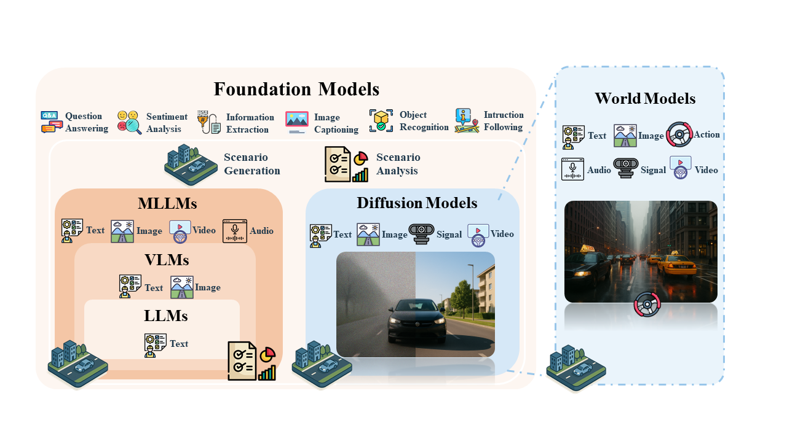

# Foundational Models for Scenario Generation and Analysis in Autonomous Driving :car:
<div align="center">
<a href="https://example.com/paper-to-be-published"></a>
<a href="https://github.com/TUM-AVS/FM-for-Scenario-Generation-Analysis/stargazers"></a>
<a href="https://github.com/TUM-AVS/FM-for-Scenario-Generation-Analysis/network/members"></a>
<a href="https://github.com/TUM-AVS/FM-for-Scenario-Generation-Analysis/pulls"></a>
<a href="https://github.com/TUM-AVS/FM-for-Scenario-Generation-Analysis/issues"></a>
<a href="https://github.com/TUM-AVS/FM-for-Scenario-Generation-Analysis/blob/main/LICENSE"></a>
</div>

This repository will collect research, implementations, and resources related to **Foundational Models for Scenario Generation and Analysis** in autonomous driving. The repository will be maintained by [TUM-AVS](https://www.mos.ed.tum.de/avs/startseite/) (Professorship of Autonomous Vehicle Systems at Technical University of Munich) and will be continuously updated to track the latest work in the community.

**Keywords: Foundational Models, Large Language Models, Multimodal Large Language Modals, Vision Language Models, Diffusion Models, World Models, Scenario Generation, Scenario Analysis, Autonomous Driving, Safety Assurance**

<p align="center">

</p>

## :fire: Updates
- [May.2024] Repository initialized

## 🤝 &nbsp; Citation
Please visit [Foundational Models for Scenario Generation and Analysis in Autonomous Driving: A Comprehensive Survey](https://example.com/paper-to-be-published) for more details and comprehensive information (coming soon). If you find our paper and repo helpful, please consider citing it as follows:

```BibTeX
@article{FMs-for-Scenario-Generation-Analysis,
  author={TBD},
  title={Foundational Models for Scenario Generation and Analysis in Autonomous Driving: A Comprehensive Survey},
  journal={TBD},
  year={2024},
  pages={TBD},
  doi={TBD}
}
```

## :page_with_curl: Introduction
Foundational models are large-scale, pre-trained models that can be adapted to a wide range of downstream tasks. In the context of autonomous driving, foundational models offer a powerful approach to scenario generation and analysis, enabling more comprehensive and realistic testing, validation, and verification of autonomous driving systems. This repository aims to collect and organize research, tools, and resources in this important field.

<p align="center">

</p>


## 🌟 Diffusion Models for Autonomous Driving

| Paper | Date | Venue | Code | Application |
|:------|:-----|:------|:-----|:------------|
| [Guided Conditional Diffusion for Controllable Traffic Simulation](https://aiasd.github.io/ctg.github.io/) | 2022-10 | ICRA 2023 | [GitHub](https://github.com/NVlabs/CTG) | Scenario Generation |
| [DiffScene: Guided Diffusion Models for Safety-Critical Scenario Generation](https://openreview.net/forum?id=hclEbdHida) | 2023-06 | AdvML-Frontiers 2023 | - | Scenario Generation |
| [BEVControl: Accurately Controlling Street-view Elements with Multi-perspective Consistency via BEV Sketch Layout](https://arxiv.org/abs/2308.01661) | 2023-09 | arXiv | - | Scenario Generation |
| [DriveSceneGen: Generating Diverse and Realistic Driving Scenarios From Scratch](https://ieeexplore.ieee.org/document/10468551) | 2023-09 | IEEE Robotics and Automation Letters 2024 | - | Scenario Generation |
| [MagicDrive: Street View Generation with Diverse 3D Geometry Control](https://arxiv.org/abs/2310.02601) | 2023-10 | ICLR 2024 | [GitHub](https://github.com/cure-lab/MagicDrive) | Scenario Generation |
| [Language-guided traffic simulation via scene-level diffusion](https://research.nvidia.com/labs/avg/publication/zhong.rempe.etal.corl23/) | 2023-11 | CoRL 2023 | - | Scenario Generation |
| [Scenario Diffusion: Controllable Driving Scenario Generation With Diffusion](https://neurips.cc/virtual/2023/poster/72611) | 2023-11 | NeurIPS 2023 | - | Scenario Generation |
| [Panacea: Panoramic and Controllable Video Generation for Autonomous Driving](https://arxiv.org/abs/2311.16813) | 2023-11 | CVPR 2024 | [GitHub](https://github.com/wenyuqing/panacea) | Scenario Generation |
| [SAFE-SIM: Safety-Critical Closed-Loop Traffic Simulation with Diffusion-Controllable Adversaries](https://arxiv.org/abs/2312.10664) | 2023-12 | ECCV 2024 | [GitHub](https://github.com/jxmmy7777/safe-sim) | Scenario Generation |
| [ScePT: Scenario Pre-Training for Policy Transfer](https://arxiv.org/abs/2401.09633) | 2024-01 | ECCV 2024 | - | Scenario Generation |
| [Text2Street: Controllable Text-to-image Generation for Street Views](https://arxiv.org/abs/2402.04504) | 2024-02 | ICPR 2024 | - | Scenario Generation |
| [GEODIFFUSION: Text-Prompted Geometric Control for Object Detection Data Generation](https://arxiv.org/abs/2402.15504) | 2024-02 | LCLR 2024 | [Website](https://github.com/ML-GSAI/GeoDiffusion) | Scenario Generation |
| [DriveDiffusion: Conditional Driving Scene Generation with Diffusion Models](https://arxiv.org/abs/2402.07234) | 2024-02 | arXiv | - | Scenario Generation |
| [Versatile Behavior Diffusion for Generalized Traffic Agent Simulation](https://arxiv.org/abs/2404.20292) | 2024-04 | RSS 2024 | [GitHub](https://github.com/SafeRoboticsLab/VBD) | Scenario Generation |
| [GenDDS: Generating Diverse Driving Video Scenarios with Prompt-to-Video Generative Model](https://arxiv.org/abs/2404.15337) | 2024-04 | ITSC 2024 | - | Scenario Generation |
| [DriveDreamer-2: LLM-Enhanced World Models for Diverse Driving Video Generation](https://arxiv.org/abs/2403.06845) | 2024-03 | arXiv | [Website](https://drivedreamer2.github.io/) | Scenario Generation |
| [SceneControl: Diffusion for Controllable Traffic Scene Generation](https://arxiv.org/abs/2405.09414) | 2024-05 | ICRA 2024 | - | Scenario Generation |
| [DrivingGen: Efficient Safety-Critical Driving Video Generation with Latent Diffusion Models](https://arxiv.org/abs/2407.09720) | 2024-07 | ICME 2024 | - | Scenario Generation |
| [SLEDGE: Synthesizing Driving Environments with Generative Models and Rule-Based Traffic](https://arxiv.org/abs/2407.17728) | 2024-07 | ECCV 2024 | [GitHub](https://github.com/autonomousvision/sledge) | Scenario Generation |
| [DriveGenVLM: Real-world Video Generation for Vision Language Model based Autonomous Driving](https://ieeexplore.ieee.org/abstract/document/10786438) | 2024-08 | IAVVC 2024 | - | Scenario Generation, Scenario Analysis |
| [AdvDiffuser: Generating Adversarial Safety-Critical Driving Scenarios via Guided Diffusion](https://arxiv.org/abs/2310.01706) | 2024-10 | IROS 2023 | - | Scenario Generation |
| [Data-driven Diffusion Models for Enhancing Safety in Autonomous Vehicle Traffic Simulations](https://arxiv.org/abs/2410.04809) | 2024-04 | arXiv | - | Scenario Generation |
| [DiffRoad: Realistic and Diverse Road Scenario Generation for Autonomous Vehicle Testing](https://arxiv.org/abs/2411.09451) | 2024-11 | arXiv | - | Scenario Generation |
| [SceneDiffuser: Efficient and Controllable Driving Simulation Initialization and Rollout](https://arxiv.org/pdf/2412.12129) | 2024-12 | NeurIPS 2024 | [GitHub](https://github.com/autopilot-hub/SceneDiffuser) | Scenario Generation |
| [Direct Preference Optimization-Enhanced Multi-Guided Diffusion Model for Traffic Scenario Generation](https://www.arxiv.org/pdf/2502.12178) | 2025-02 | - | - | Scenario Generation |
| [AVD2: Accident Video Diffusion for Accident Video Description](https://arxiv.org/pdf/2502.14801) | 2025-03 | ICRA 2025 | [GitHub](https://github.com/opendrivelab/AVD2) | Scenario Generation |
| [Semantic Image Synthesis via Diffusion Models](https://arxiv.org/abs/2211.11677) | 2022-11 | arXiv | [GitHub](https://github.com/WeilunWang/semantic-diffusion-model) | Scenario Generation |
| [Generating Driving Scenes with Diffusion](https://arxiv.org/abs/2305.11599) | 2023-05 | arXiv | - | Scenario Generation |
| [Controllable Diffusion Models for Safety-Critical Driving Scenario Generation](https://ieeexplore.ieee.org/document/10356547) | 2023-11 | ICTAI 2023 | - | Scenario Generation |
| [DrivingDiffusion: Layout-Guided multi-view driving scene video generation with latent diffusion model](https://arxiv.org/abs/2310.01916) | 2023-10 | ECCV 2024 | - | Scenario Generation |
| [Street-View Image Generation from a Bird's-Eye View Layout](https://ieeexplore.ieee.org/abstract/document/10409714) | 2024-02 | IEEE Robotics and Automation Letters | - | Scenario Generation |

## 🌟 Large Language Models for Autonomous Driving

### Scenario Generation

| Paper | Date | Venue | Code |
|:------|:-----|:------|:-----|
| [TARGET: Automated Scenario Generation from Traffic Rules for Testing Autonomous Vehicles](https://arxiv.org/abs/2305.06018) | 2023-05 | arXiv | - |
| [Language Conditioned Traffic Generation](https://arxiv.org/abs/2307.07947) | 2023-07 | CoRL 2023 | [GitHub](https://github.com/Ariostgx/lctgen) |
| [A Generative AI-driven Application: Use of Large Language Models for Traffic Scenario Generation](https://ieeexplore.ieee.org/document/10415934) | 2023-11 | ELECO 2023 | - |
| [ChatGPT-Based Scenario Engineer: A New Framework on Scenario Generation for Trajectory Prediction](https://ieeexplore.ieee.org/document/10423819) | 2024-02 | IEEE Transactions on Intelligent Vehicles | - |
| [Enhancing Autonomous Vehicle Training with Language Model Integration and Critical Scenario Generation](https://arxiv.org/abs/2404.08570) | 2024-04 | arXiv | [GitHub](https://github.com/zachtian/CRITICAL) |
| [LLMScenario: Large Language Model Driven Scenario Generation](https://ieeexplore.ieee.org/document/10529537) | 2024-05 | IEEE Transactions on Systems, Man, and Cybernetics: Systems | - |
| [Chatscene: Knowledge-enabled safety-critical scenario generation for autonomous vehicles](https://ieeexplore.ieee.org/stamp/stamp.jsp?arnumber=10655362) | 2024-05 | CVPR 2024 | [GitHub](https://github.com/javyduck/ChatScene) |
| [Editable Scene Simulation for Autonomous Driving via Collaborative LLM-Agents](https://ieeexplore.ieee.org/document/10656629) | 2024-06 | CVPR 2024 | [GitHub](https://github.com/yifanlu0227/ChatSim) |
| [Chat2Scenario: Scenario Extraction From Dataset Through Utilization of Large Language Model](https://ieeexplore.ieee.org/document/10588843) | 2024-06 | IEEE IV 2024 | [GitHub](https://github.com/ftgTUGraz/Chat2Scenario) |
| [Multimodal Large Language Model Driven Scenario Testing for Autonomous Vehicles](https://arxiv.org/abs/2409.06450) | 2024-09 | arXiv | - |
| [Traffic Scene Generation from Natural Language Description for Autonomous Vehicles with Large Language Model](https://arxiv.org/abs/2409.09575) | 2024-09 | arXiv | [GitHub](https://github.com/basiclab/TTSG) |
| [Promptable Closed-loop Traffic Simulation](https://arxiv.org/abs/2409.05863) | 2024-09 | CoRL 2024 | [Website](https://ariostgx.github.io/ProSim/) |
| [ChatSUMO: Large Language Model for Automating Traffic Scenario Generation in Simulation of Urban MObility](https://ieeexplore.ieee.org/document/10770822) | 2024-11 | IEEE Transactions on Intelligent Vehicles | - |
| [Generating Out-Of-Distribution Scenarios Using Language Models](https://arxiv.org/pdf/2411.16554) | 2024-11 | arXiv | - |
| [LLM-Driven Testing for Autonomous Driving Scenarios](https://ieeexplore.ieee.org/document/10852505) | 2024-11 | FLLM 2024 | - |
| [Generating Traffic Scenarios via In-Context Learning to Learn Better Motion Planner](https://arxiv.org/abs/2412.18086) | 2024-12 | AAAI 2025 (Oral) | [GitHub](https://github.com/YuqiHuai/in-context-scenario-gen) |
| [LLM-attacker: Enhancing Closed-loop Adversarial Scenario Generation for Autonomous Driving with Large Language Models](https://arxiv.org/abs/2501.01350) | 2025-01 | arXiv | - |
| [SoVAR: Building Generalizable Scenarios from Accident Reports for Autonomous Driving Testing](https://dl.acm.org/doi/10.1145/3609026.3609580) | 2024-09 | ASE 2024 | - |
| [LeGEND: A Top-Down Approach to Scenario Generation of Autonomous Driving Systems Assisted by Large Language Models](https://dl.acm.org/doi/10.1145/3609026.3609034) | 2024-09 | ASE 2024 | - |

### Scenario Analysis

| Paper | Date | Venue | Code |
|:------|:-----|:------|:-----|
| [LLM Multimodal Traffic Accident Forecasting](https://www.mdpi.com/1424-8220/23/23/9513) | 2023-11 | Sensors 2023 MDPI | - |
| [REALITY BITES: ASSESSING THE REALISM OF DRIVING SCENARIOS WITH LARGE LANGUAGE MODELS](https://arxiv.org/abs/2403.09906) | 2024-03 | IEEE/ACM Forge 2024 | [GitHub](https://github.com/Simula-COMPLEX/RealityBites) |
| [Driving with LLMs: Fusing Object-Level Vector Modality for Explainable Autonomous Driving](https://ieeexplore.ieee.org/abstract/document/10611018) | 2024-05 | ICRA 2024 | [GitHub](https://github.com/wayveai/Driving-with-LLMs) |
| [Enhancing LLM-based Autonomous Driving Agents to Mitigate Perception Attacks](https://arxiv.org/abs/2409.14488) | 2024-09 | arXiv | - |
| [Foundation Models for Rapid Autonomy Validation](https://arxiv.org/abs/2411.03328) | 2024-10 | arXiv | - |
| [Generating Out-Of-Distribution Scenarios Using Language Models](https://arxiv.org/pdf/2411.16554) | 2024-11 | arXiv | - |
| [SenseRAG: Constructing Environmental Knowledge Bases with Proactive Querying for LLM-Based Autonomous Driving](https://arxiv.org/abs/2501.00745) | 2025-01 | arXiv | - |

## 🌟 Vision-Language Models for Autonomous Driving

| Paper | Date | Venue | Code |
|:------|:-----|:------|:-----|
| [NuScenes-QA: A Multi-modal Visual Question Answering Benchmark for Autonomous Driving Scenario](https://arxiv.org/abs/2305.14836) | 2023-05 | AAAI 2024 | [GitHub](https://github.com/qiantianwen/NuScenes-QA) |
| [WEDGE: A multi-weather autonomous driving dataset built from generative vision-language models](https://arxiv.org/pdf/2305.07528) | 2023-05 | CVPR Workshop 2023 | [arXiv](https://arxiv.org/abs/2305.07528) |
| [Reason2Drive: Towards Interpretable and Chain-based Reasoning for Autonomous Driving](https://arxiv.org/abs/2312.03661) | 2023-12 | arXiv | [GitHub](https://github.com/fudan-zvg/Reason2Drive) |
| [MAPLM: A Real-World Large-Scale Vision-Language Benchmark for Map and Traffic Scene Understanding](https://openaccess.thecvf.com/content/CVPR2024/papers/Cao_MAPLM_A_Real-World_Large-Scale_Vision-Language_Benchmark_for_Map_and_Traffic_CVPR_2024_paper.pdf) | 2024-01 | CVPR 2024 | [GitHub](https://github.com/LLVM-AD/MAPLM) |
| [Is it safe to cross? Interpretable Risk Assessment with GPT-4V for Safety-Aware Street Crossing](https://ieeexplore.ieee.org/stamp/stamp.jsp?arnumber=10597464) | 2024-02 | UR 2024 | - |
| [DriveGenVLM: Real-world Video Generation for Vision Language Model based Autonomous Driving](https://ieeexplore.ieee.org/abstract/document/10786438) | 2024-08 | IAVVC 2024 | - |
| [Multimodal Large Language Model Driven Scenario Testing for Autonomous Vehicles](https://arxiv.org/abs/2409.06450) | 2024-09 | arXiv | - |
| [Generating Out-Of-Distribution Scenarios Using Language Models](https://arxiv.org/pdf/2411.16554) | 2024-11 | arXiv | - |
| [From Dashcam Videos to Driving Simulations: Stress Testing Automated Vehicles against Rare Events](https://arxiv.org/pdf/2411.16027) | 2024-11 | arXiv | - |
| [SFF Rendering-Based Uncertainty Prediction using VisionLLM](https://openreview.net/forum?id=q8ptjh1pDl) | 2024-12 | OpenReview | - |
| [LMM-enhanced Safety-Critical Scenario Generation for Autonomous Driving System Testing From Non-Accident Traffic Videos](https://arxiv.org/pdf/2406.10857) | 2025-01 | arXiv | - |
| [INSIGHT: Enhancing Autonomous Driving Safety through Vision-Language Models on Context-Aware Hazard Detection and Edge Case Evaluation](https://www.arxiv.org/abs/2502.00262) | 2025-02 | arXiv | - |
| [CurricuVLM: Towards Safe Autonomous Driving via Personalized Safety-Critical Curriculum Learning with Vision-Language Models](https://arxiv.org/abs/2502.15119) | 2025-02 | arXiv | [Website](https://zihaosheng.github.io/CurricuVLM/) |
| [VaViM and VaVAM: Autonomous Driving through Video Generative Modeling](https://arxiv.org/abs/2502.15672) | 2025-02 | arXiv | [GitHub](https://github.com/valeoai/VideoActionModel) |
| [DriveGen: Towards Infinite Diverse Traffic Scenarios with Large Models](https://arxiv.org/pdf/2503.05808) | 2025-03 | arXiv | - |

## 🌟 World Models for Autonomous Driving

| Paper | Date | Venue | Code |
|:------|:-----|:------|:-----|
| [GAIA-1: A Generative World Model for Autonomous Driving](https://arxiv.org/abs/2309.17080) | 2023-09 | arXiv | - |
| [DriveDreamer: Towards Real-world-driven World Models for Autonomous Driving](https://arxiv.org/abs/2309.09777) | 2023-09 | ECCV 2024 | [GitHub](https://github.com/JeffWang987/DriveDreamer) |
| [Driving into the Future: Multiview Visual Forecasting and Planning with World Model for Autonomous Driving](https://arxiv.org/abs/2311.17918) | 2023-11 | CVPR 2024 | [GitHub](https://github.com/BraveGroup/Drive-WM) |
| [ADriver-I: A General World Model for Autonomous Driving](https://arxiv.org/abs/2311.13549) | 2023-11 | CoRR 2023 | - |
| [DriveDreamer-2: LLM-Enhanced World Models for Diverse Driving Video Generation](https://arxiv.org/pdf/2403.06845) | 2024-05 | arXiv | [GitHub](https://github.com/f1yfisher/DriveDreamer2) |
| [DriveArena: A Closed-loop Generative Simulation Platform for Autonomous Driving](https://arxiv.org/abs/2408.00415) | 2024-08 | arXiv | [GitHub](https://github.com/PJLab-ADG/DriveArena) |
| [Panacea+: Panoramic and Controllable Video Generation for Autonomous Driving](https://arxiv.org/abs/2408.07605) | 2024-08 | arXiv | [GitHub](https://github.com/wenyuqing/panacea) |
| [DriveDreamer4D: World Models Are Effective Data Machines for 4D Driving Scene Representation](https://arxiv.org/abs/2410.13571) | 2024-11 | arXiv | [GitHub](https://github.com/GigaAI-research/DriveDreamer4D) |
| [MagicDrive3D: Controllable 3D Generation for Any-View Rendering in Street Scenes](https://arxiv.org/abs/2405.14475) | 2024-11 | arXiv | - |
| [MagicDriveDiT: High-Resolution Long Video Generation for Autonomous Driving with Adaptive Control](https://arxiv.org/abs/2411.13807) | 2024-11 | arXiv | - |
| [SceneDiffuser++: City-Scale Traffic Simulation via a Generative World Model](https://arxiv.org/abs/2412.12129) | 2024-12 | CVPR 2025 | - |
| [GAIA-2: A Controllable Multi-View Generative World Model for Autonomous Driving](/) | 2025-03 | - | - |


## 🌟 Datasets Comparison

| Dataset | Year | Img | View | Real | Lidar | Radar | Traj | 3D | 2D | Lane | Weather | Time | Region | Company |
|:--------|:-----|:----|:-----|:-----|:------|:------|:-----|:---|:---|:-----|:--------|:-----|:-------|:--------|
| CamVid | 2009 | RGB | FPV | ✅ | ❌ | ❌ | ❌ | ❌ | ✅ | ✅ | ✅ | D | U | - |
| KITTI | 2013 | RGB/S | FPV | ✅ | ✅ | ❌ | ✅ | ✅ | ✅ | ✅ | ✅ | D | U/R/H | - |
| Cyclists | 2016 | RGB | FPV | ✅ | ❌ | ❌ | ❌ | ❌ | ❌ | ❌ | ❌ | D | U | - |
| Cityscapes | 2016 | RGB/S | FPV | ✅ | ❌ | ❌ | ❌ | ✅ | ✅ | ✅ | ❌ | D | U | - |
| SYNTHIA | 2016 | RGB | FPV | ❌ | ❌ | ❌ | ❌ | ✅ | ✅ | ✅ | ✅ | D/N | U | - |
| Campus | 2016 | RGB | BEV | ❌ | ❌ | ❌ | ❌ | ❌ | ❌ | ❌ | ❌ | D | C | - |
| RobotCar | 2016 | RGB | FPV | ✅ | ❌ | ❌ | ❌ | ❌ | ❌ | ❌ | ❌ | D/N | U | - |
| Mapillary | 2017 | RGB | FPV | ✅ | ❌ | ❌ | ❌ | ❌ | ✅ | ✅ | ✅ | D/N | U | - |
| P.F.B. | 2017 | RGB | FPV | ✅ | ❌ | ❌ | ❌ | ❌ | ✅ | ✅ | ✅ | D/N | U | - |
| BDD100K | 2018 | RGB | FPV | ✅ | ❌ | ❌ | ❌ | ✅ | ✅ | ✅ | ✅ | D | U/H | - |
| HighD | 2018 | RGB | BEV | ✅ | ❌ | ❌ | ❌ | ❌ | ✅ | ✅ | ❌ | D | H | - |
| Udacity | 2018 | RGB | FPV | ✅ | ❌ | ❌ | ❌ | ❌ | ❌ | ❌ | ❌ | D | U | - |
| KAIST | 2018 | RGB/S | FPV | ✅ | ✅ | ❌ | ❌ | ❌ | ✅ | ✅ | ✅ | D/N | U | - |
| Argoverse | 2019 | RGB/S | FPV | ✅ | ✅ | ❌ | ❌ | ❌ | ✅ | ✅ | ✅ | D/N | U | - |
| TRAF | 2019 | RGB | FPV | ✅ | ❌ | ❌ | ❌ | ❌ | ✅ | ✅ | ✅ | D | U | - |
| ApolloScape | 2019 | RGB/S | FPV | ✅ | ❌ | ❌ | ❌ | ✅ | ✅ | ✅ | ✅ | D | U | - |
| ACFR | 2019 | RGB | BEV | ✅ | ❌ | ❌ | ❌ | ❌ | ❌ | ❌ | ❌ | D | RA | - |
| H3D | 2019 | RGB | FPV | ✅ | ❌ | ❌ | ❌ | ❌ | ✅ | ✅ | ✅ | D | U | - |
| INTERACTION | 2019 | RGB | BEV | ✅ | ❌ | ❌ | ❌ | ❌ | ❌ | ❌ | ❌ | D | I/RA | - |
| Comma2k19 | 2019 | RGB | FPV | ✅ | ❌ | ❌ | ✅ | ✅ | ❌ | ❌ | ❌ | D/N | U/S/R/H | - |
| InD | 2020 | RGB | BEV | ✅ | ❌ | ❌ | ❌ | ❌ | ❌ | ❌ | ❌ | D | I | - |
| RounD | 2020 | RGB | BEV | ✅ | ❌ | ❌ | ❌ | ❌ | ❌ | ❌ | ❌ | D | RA | - |
| nuScenes | 2020 | RGB | FPV | ✅ | ✅ | ✅ | ❌ | ✅ | ✅ | ✅ | ✅ | D/N | U | - |
| Lyft Level 5 | 2020 | RGB | FPV | ✅ | ✅ | ✅ | ❌ | ✅ | ✅ | ✅ | ✅ | D/N | U/S | - |
| Waymo Open | 2020 | RGB | FPV | ✅ | ✅ | ✅ | ✅ | ✅ | ✅ | ✅ | ✅ | D/N | U | - |
| A*3D | 2020 | RGB | FPV | ✅ | ✅ | ✅ | ✅ | ✅ | ✅ | ✅ | ✅ | D/N | U | - |
| RobotCar Radar | 2020 | RGB | FPV | ✅ | ✅ | ✅ | ✅ | ✅ | ✅ | ✅ | ✅ | D/N | U | - |
| Toronto3D | 2020 | RGB | BEV | ✅ | ✅ | ❌ | ✅ | ✅ | ❌ | ✅ | ❌ | D/N | U | University of Waterloo |
| A2D2 | 2020 | RGB | FPV | ✅ | ✅ | ✅ | ✅ | ✅ | ✅ | ❌ | ✅ | ✅ | D | U/H/S/R | Audi |
| WADS | 2020 | RGB | FPV | ✅ | ✅ | ✅ | ✅ | ✅ | ❌ | ❌ | ✅ | D/N | U/S/R | Michigan Technological University |
| Argoverse 2 | 2021 | RGB/S | FPV | ✅ | ✅ | ❌ | ❌ | ✅ | ✅ | ✅ | ✅ | D/N | U | - |
| PandaSet | 2021 | RGB | FPV | ✅ | ✅ | ✅ | ✅ | ✅ | ✅ | ✅ | ✅ | D/N | U | - |
| ONCE | 2021 | RGB | FPV | ✅ | ✅ | ✅ | ✅ | ✅ | ✅ | ✅ | ✅ | D/N | U | - |
| Leddar PixSet | 2021 | RGB | FPV | ✅ | ✅ | ❌ | ✅ | ✅ | ✅ | ❌ | ✅ | D/N | U/S/R | Leddar |
| ZOD | 2022 | RGB | FPV | ✅ | ✅ | ✅ | ✅ | ✅ | ✅ | ✅ | ✅ | D/N | U/R/S/H | Zenseact |
| IDD-3D | 2022 | RGB | FPV | ✅ | ✅ | ❌ | ❌ | ✅ | ✅ | ❌ | ❌ | - | R | INAI |
| CODA | 2022 | RGB | FPV | ✅ | ✅ | ✅ | ✅ | ✅ | ✅ | ✅ | ✅ | D/N | U/S/R | Huawei |
| SHIFT | 2022 | RGB | FPV | ✅ | ✅ | ✅ | ✅ | ✅ | ✅ | ✅ | ✅ | D/N | U/S/R/H | ETH Zürich |
| DeepAccident | 2023 | RGB/S | FPV/BEV | ❌ | ✅ | ❌ | ❌ | ✅ | ✅ | ✅ | ✅ | D/N | U/S/R/H | HKU, Huawei, CARLA |
| Dual_Radar | 2023 | RGB | FPV | ✅ | ✅ | ✅ | ✅ | ✅ | ❌ | ✅ | ✅ | D/N | U | Tsinghua University |
| V2V4Real | 2023 | RGB | FPV | ✅ | ✅ | ❌ | ✅ | ✅ | ❌ | ✅ | ❌ | - | U/H/S | UCLA Mobility Lab |
| SCaRL | 2024 | RGB/S | FPV/BEV | ❌ | ✅ | ✅ | ✅ | ✅ | ✅ | ✅ | ✅ | D/N | U/S/R/H | Fraunhofer CARLA |
| MARS | 2024 | RGB | FPV | ✅ | ✅ | ✅ | ✅ | ✅ | ✅ | ✅ | ✅ | D/N | U/S/H | NYU, MAY Mobility |
| Scenes101 | 2024 | RGB | FPV | ✅ | ❌ | ❌ | ✅ | ❌ | ❌ | ✅ | ✅ | D/N | U/S/R/H | Wayve |
| TruckScenes | 2025 | RGB | FPV | ✅ | ✅ | ✅ | ✅ | ✅ | ❌ | ✅ | ✅ | D/N | H/U | MAN |

*Notes: View: FPV=First-Person, BEV=Bird's-Eye; Time: D=Day, N=Night; Region: U=Urban, R=Rural, H=Highway, S=Suburban, C=Campus, I=Intersection, RA=Road Area; Img: RGB/S=RGB+Stereo*


## 🌟 Simulators

| Simulator | Year | Back-end | Open Source | Realistic Perception | Custom Scenario | Real World Map | Human Design Map | Python API | C++ API | ROS API | Company |
|:----------|:-----|:---------|:------------|:---------------------|:----------------|:---------------|:-----------------|:-----------|:--------|:--------|:--------|
| TORCS | 2000 | None | ✅ | ✅ | ✅ | ❌ | ❌ | ❌ | ❌ | ❌ | - |
| Webots | 2004 | ODE | ✅ | ✅ | ✅ | ✅ | ❌ | ✅ | ✅ | ❌ | - |
| CarRacing | 2017 | None | ✅ | ❌ | ❌ | ❌ | ✅ | ✅ | ❌ | ❌ | - |
| CARLA | 2017 | UE4 | ✅ | ✅ | ✅ | ❌ | ✅ | ✅ | ✅ | ✅ | - |
| SimMobilityST | 2017 | None | ✅ | ❌ | ❌ | ❌ | ❌ | ❌ | ❌ | ❌ | - |
| GTA-V | 2017 | RAGE | ❌ | ✅ | ❌ | ❌ | ❌ | ❌ | ❌ | ❌ | - |
| highway-env | 2018 | None | ✅ | ❌ | ✅ | ❌ | ✅ | ✅ | ❌ | ❌ | - |
| Deepdrive | 2018 | UE4 | ✅ | ✅ | ✅ | ❌ | ✅ | ✅ | ✅ | ❌ | - |
| esmini | 2018 | Unity | ✅ | ❌ | ❌ | ❌ | ❌ | ✅ | ❌ | ❌ | - |
| AutonoViSim | 2018 | PhysX | ❌ | ✅ | ✅ | ❌ | ❌ | ✅ | ❌ | ❌ | - |
| AirSim | 2018 | UE4 | ✅ | ✅ | ✅ | ❌ | ✅ | ✅ | ✅ | ❌ | - |
| SUMO | 2018 | None | ✅ | ❌ | ✅ | ✅ | ✅ | ❌ | ✅ | ❌ | - |
| Apollo | 2018 | Unity | ✅ | ✅ | ✅ | ✅ | ✅ | ✅ | ✅ | ❌ | - |
| Sim4CV | 2018 | UE4 | ✅ | ✅ | ✅ | ❌ | ✅ | ✅ | ❌ | ❌ | - |
| MATLAB | 2018 | MATLAB | ❌ | ✅ | ✅ | ✅ | ✅ | ✅ | ✅ | ✅ | Mathworks |
| Scenic | 2019 | None | ✅ | ✅ | ✅ | ✅ | ✅ | ✅ | ❌ | ❌ | Toyota Research Institute, UC Berkeley |
| SUMMIT | 2020 | UE4 | ✅ | ✅ | ✅ | ❌ | ✅ | ✅ | ✅ | ❌ | - |
| MultiCarRacing | 2020 | None | ✅ | ❌ | ✅ | ❌ | ✅ | ✅ | ❌ | ❌ | - |
| SMARTS | 2020 | None | ✅ | ✅ | ✅ | ✅ | ✅ | ✅ | ❌ | ❌ | - |
| LGSVL | 2020 | Unity | ✅ | ✅ | ✅ | ✅ | ✅ | ✅ | ✅ | ✅ | - |
| CausalCity | 2020 | UE4 | ✅ | ✅ | ✅ | ✅ | ✅ | ✅ | ❌ | ❌ | - |
| Vista | 2020 | None | ✅ | ✅ | ✅ | ✅ | ❌ | ✅ | ❌ | ❌ | MIT |
| MetaDrive | 2021 | Panda3D | ✅ | ✅ | ✅ | ✅ | ✅ | ✅ | ✅ | ❌ | - |
| L2R | 2021 | UE4 | ✅ | ✅ | ✅ | ✅ | ✅ | ✅ | ✅ | ❌ | - |
| AutoDRIVE | 2021 | Unity | ✅ | ✅ | ✅ | ✅ | ✅ | ✅ | ✅ | ✅ | - |
| Nuplan | 2021 | None | ✅ | ✅ | ✅ | ✅ | ✅ | ✅ | ❌ | ❌ | Motional |
| AWSIM | 2021 | Unity | ✅ | ✅ | ✅ | ✅ | ✅ | ❌ | ❌ | ✅ | Autoware |
| InterSim | 2022 | None | ✅ | ✅ | ✅ | ✅ | ❌ | ✅ | ❌ | ❌ | Tsinghua |
| Nocturne | 2022 | None | ✅ | ✅ | ✅ | ✅ | ✅ | ✅ | ✅ | ❌ | Facebook |
| BeamNG.tech | 2022 | Soft-body physics | ❌ | ✅ | ✅ | ❌ | ✅ | ✅ | ❌ | ✅ | BeamNG GmbH |
| Waymax | 2023 | JAX | ✅ | ✅ | ✅ | ❌ | ✅ | ✅ | ❌ | ❌ | Waymo |
| UNISim | 2023 | None | ❌ | ✅ | ✅ | ✅ | ❌ | ❌ | ✅ | ❌ | Waabi |
| TBSim | 2023 | None | ✅ | ✅ | ✅ | ✅ | ✅ | ✅ | ❌ | ❌ | NVIDIA |
| Nvidia DriveWorks | 2024 | Nvidia GPU | ❌ | ✅ | ✅ | ✅ | ❌ | ✅ | ✅ | ❌ | NVIDIA |

### Generative AI Tools
This section will list tools for scenario generation and simulation based on foundational models.

### Scenario Generation Frameworks
This section will list frameworks for generating scenarios based on foundational models such as diffusion models and GANs.

## 🌟 Research Areas (Coming Soon)

### Scenario Generation
This section will include research on generating meaningful and comprehensive scenarios for testing autonomous driving systems using foundational models such as diffusion models, GANs, and other generative AI approaches.

### Scenario Analysis
This section will include research on analyzing scenarios using foundational models to verify safety properties and performance metrics of autonomous driving systems.

## Contributing
We welcome contributions from the community! If you have research papers, tools, or resources to add, please create a pull request or open an issue.

## License
This repository is released under the [Apache 2.0 license](https://github.com/TUM-AVS/FM-for-Scenario-Generation-Analysis/blob/main/LICENSE). 

## 🌟 Multimodal Large Language Models for Autonomous Driving

### Scenario Generation

| Paper | Date | Venue | Code | 
|:------|:-----|:------|:-----|
| [ADriver-I: A General World Model for Autonomous Driving](https://arxiv.org/abs/2311.13549) | 2023-11 | CoRR 2023 | - |
| [Realistic Corner Case Generation for Autonomous Vehicles with Multimodal Large Language Model](https://arxiv.org/abs/2411.09172) | 2024-11 | arXiv | - |
| [LMM-enhanced Safety-Critical Scenario Generation for Autonomous Driving System Testing From Non-Accident Traffic Videos](https://arxiv.org/pdf/2501.09371) | 2025-01 | arXiv | [Website](https://anonymous.4open.science/r/CRISER/README.md) |

### Scenario Analysis

| Paper | Date | Venue | Code |
|:------|:-----|:------|:-----|
| [Lidar-llm: Exploring the potential of large language models for 3d lidar understanding](https://arxiv.org/abs/2312.14074) | 2023-12 | AAAI 2025 | [Website](https://sites.google.com/view/lidar-llm) |
| [Dolphins: Multimodal Language Model for Driving](https://arxiv.org/abs/2312.00438) | 2023-12 | ECCV 2024 | [Website](https://vlm-driver.github.io/) |
| [AccidentGPT: Accident analysis and prevention from V2X Environmental Perception with Multi-modal Large Model](https://arxiv.org/abs/2312.09649) | 2023-12 | IEEE IV 2024 | [Website](https://deepaccident.github.io/) |
| [MAPLM: A Real-World Large-Scale Vision-Language Benchmark for Map and Traffic Scene Understanding](https://openaccess.thecvf.com/content/CVPR2024/papers/Cao_MAPLM_A_Real-World_Large-Scale_Vision-Language_Benchmark_for_Map_and_Traffic_CVPR_2024_paper.pdf) | 2024-01 | CVPR 2024 | [GitHub](https://github.com/LLVM-AD/MAPLM) |
| [Holistic Autonomous Driving Understanding by Bird's-Eye-View Injected Multi-Modal Large Models](https://arxiv.org/abs/2401.02335) | 2024-01 | CVPR 2024 | [GitHub](https://github.com/xmed-lab/NuInstruct) |
| [RAG-Driver: Generalisable Driving Explanations with Retrieval-Augmented In-Context Learning in Multi-Modal Large Language Model](https://arxiv.org/abs/2405.16467) | 2024-05 | RSS 2024 | - |
| [Semantic Understanding of Traffic Scenes with Large Vision Language Models](https://arxiv.org/abs/2406.08603) | 2024-06 | IEEE IV 2024 | [GitHub](https://github.com/sandeshrjain/lvlm-scene) |
| [VLAAD: Vision and Language Assistant for Autonomous Driving](https://ieeexplore.ieee.org/document/10495690) | 2024-06 | WACVW 2024 | - |
| [InternDrive: A Multimodal Large Language Model for Autonomous Driving Scenario Understanding](https://arxiv.org/abs/2407.10750) | 2024-07 | AIAHPC 2024 | - |
| [Using Multimodal Large Language Models for Automated Detection of Traffic Safety Critical Events](https://www.mdpi.com/2624-8921/6/3/35) | 2024-09 | Vehicles 2024 MDPI | - |
| [LingoQA: Visual Question Answering for Autonomous Driving](https://arxiv.org/abs/2309.11436) | 2024-09 | ECCV 2024 | [GitHub](https://github.com/wayveai/LingoQA) |
| [MLLM-SUL: Multimodal Large Language Model for Semantic Scene Understanding and Localization in Traffic Scenarios](https://arxiv.org/abs/2412.09358) | 2024-12 | arXiv | [GitHub](https://github.com/fjq-tongji/MLLM-SUL) |
| [ScVLM: Enhancing Vision-Language Model for Safety-Critical Event Understanding](https://arxiv.org/abs/2502.06124) | 2025-02 | WACV Workshop 2025 | [GitHub](https://github.com/datadrivenwheels/ScVLM) |
| [A Framework for a Capability-driven Evaluation of Scenario Understanding for Multimodal Large Language Models in Autonomous Driving](https://arxiv.org/abs/2503.14557) | 2025-03 | IEEE IAVVC 2025 (Under Review) | - |
| [DriveLMM-o1: A Step-by-Step Reasoning Dataset and Large Multimodal Model for Driving Scenario Understanding](https://arxiv.org/abs/2503.09847) | 2025-03 | arXiv | [GitHub](https://github.com/ayesha-ishaq/DriveLMM-o1) |
| [NuGrounding: A Multi-View 3D Visual Grounding Framework in Autonomous Driving](https://arxiv.org/abs/2503.18089) | 2025-03 | arXiv | - |
| [HiLM-D: Enhancing MLLMs with Multi-Scale High-Resolution Details for Autonomous Driving](https://arxiv.org/abs/2503.18083) | 2025-03 | International Journal of Computer Vision | - |

## 🌟 Vision-Language Models for Autonomous Driving
``` 