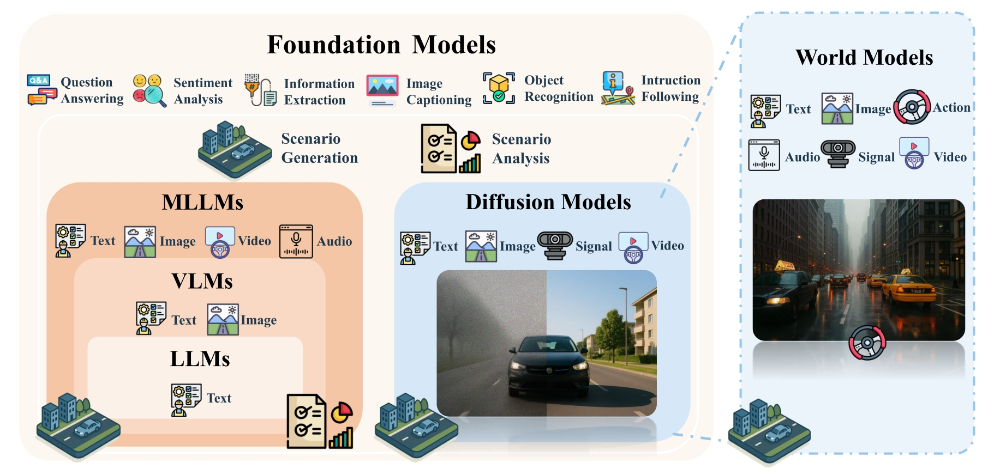

# Foundational Models for Scenario Generation and Analysis in Autonomous Driving :car:
<div align="center">
<a href="https://example.com/paper-to-be-published"></a>
<a href="https://github.com/TUM-AVS/FM-for-Scenario-Generation-Analysis/stargazers"></a>
<a href="https://github.com/TUM-AVS/FM-for-Scenario-Generation-Analysis/network/members"></a>
<a href="https://github.com/TUM-AVS/FM-for-Scenario-Generation-Analysis/pulls"></a>
<a href="https://github.com/TUM-AVS/FM-for-Scenario-Generation-Analysis/issues"></a>
<a href="https://github.com/TUM-AVS/FM-for-Scenario-Generation-Analysis/blob/main/LICENSE"></a>
</div>

This repository will collect research, implementations, and resources related to **Foundational Models for Scenario Generation and Analysis** in autonomous driving. The repository will be maintained by [TUM-AVS](https://www.mos.ed.tum.de/avs/startseite/) (Chair of Autonomous Vehicle Systems at Technical University of Munich) and will be continuously updated to track the latest work in the community.

**Keywords: Foundational Models, Large Language Models, Multimodal Large Language Modals, Vision Language Models, Diffusion Models, World Models, Scenario Generation, Scenario Analysis, Autonomous Driving, Safety Assurance**

## :fire: Updates
- [May.2024] Repository initialized

## 🤝 &nbsp; Citation
Please visit [Foundational Models for Scenario Generation and Analysis in Autonomous Driving: A Comprehensive Survey](https://example.com/paper-to-be-published) for more details and comprehensive information (coming soon). If you find our paper and repo helpful, please consider citing it as follows:

```BibTeX
@article{FMs-for-Scenario-Generation-Analysis,
  author={TBD},
  title={Foundational Models for Scenario Generation and Analysis in Autonomous Driving},
  journal={TBD},
  year={2024},
  pages={TBD},
  doi={TBD}
}
```

## :page_with_curl: Introduction
Foundational models are large-scale, pre-trained models that can be adapted to a wide range of downstream tasks. In the context of autonomous driving, foundational models offer a powerful approach to scenario generation and analysis, enabling more comprehensive and realistic testing, validation, and verification of autonomous driving systems. This repository aims to collect and organize research, tools, and resources in this important field.

<p align="center">

</p>

## 🌟 Research Areas (Coming Soon)

### Scenario Generation
This section will include research on generating meaningful and comprehensive scenarios for testing autonomous driving systems using foundational models such as diffusion models, GANs, and other generative AI approaches.

### Scenario Analysis
This section will include research on analyzing scenarios using foundational models to verify safety properties and performance metrics of autonomous driving systems.

### Foundation Models for Autonomous Driving
This section will include research on adapting and applying foundation models like large language models (LLMs), vision-language models (VLMs), and generative models to various autonomous driving tasks.

## 🌟 Diffusion Models for Autonomous Driving

| Paper | Date | Venue | Code |
|:------|:-----|:------|:-----|
| [Guided Conditional Diffusion for Controllable Traffic Simulation](https://aiasd.github.io/ctg.github.io/) | 2022-10 | ICRA 2023 | [GitHub](https://github.com/NVlabs/CTG) |
| [DiffScene: Guided Diffusion Models for Safety-Critical Scenario Generation](https://openreview.net/forum?id=hclEbdHida) | 2023-06 | AdvML-Frontiers 2023 | - |
| [BEVControl: Accurately Controlling Street-view Elements with Multi-perspective Consistency via BEV Sketch Layout](https://arxiv.org/abs/2308.01661) | 2023-09 | arXiv | - |
| [MagicDrive: Street View Generation with Diverse 3D Geometry Control](https://arxiv.org/abs/2310.02601) | 2023-10 | ICLR 2024 | [GitHub](https://github.com/cure-lab/MagicDrive) |
| [Language-guided traffic simulation via scene-level diffusion](https://research.nvidia.com/labs/avg/publication/zhong.rempe.etal.corl23/) | 2023-11 | CoRL 2023 | - |
| [Scenario Diffusion: Controllable Driving Scenario Generation With Diffusion](https://neurips.cc/virtual/2023/poster/72611) | 2023-11 | NeurIPS 2023 | - |
| [Controllable Diffusion Models for Safety-Critical Driving Scenario Generation](https://ieeexplore.ieee.org/document/10356547) | 2023-11 | ICTAI 2023 | - |
| [Panacea: Panoramic and Controllable Video Generation for Autonomous Driving](https://arxiv.org/abs/2311.16813) | 2023-11 | CVPR 2024 | [GitHub](https://github.com/wenyuqing/panacea) |
| [ScePT: Scenario Pre-Training for Policy Transfer](https://arxiv.org/abs/2401.09633) | 2024-01 | ECCV 2024 | - |
| [DriveDiffusion: Conditional Driving Scene Generation with Diffusion Models](https://arxiv.org/abs/2402.07234) | 2024-02 | arXiv | - |
| [DriveDreamer-2: LLM-Enhanced World Models for Diverse Driving Video Generation](https://arxiv.org/abs/2403.06845) | 2024-03 | arXiv | [Website](https://drivedreamer2.github.io/) |
| [Data-driven Diffusion Models for Enhancing Safety in Autonomous Vehicle Traffic Simulations](https://arxiv.org/abs/2410.04809) | 2024-04 | arXiv | - |
| [DiffRoad: Realistic and Diverse Road Scenario Generation for Autonomous Vehicle Testing](https://arxiv.org/abs/2411.09451) | 2024-11 | arXiv | - |
| [SceneDiffuser: Efficient and Controllable Driving Simulation Initialization and Rollout](https://arxiv.org/pdf/2412.12129) | 2024-12 | NeurIPS 2024 | [GitHub](https://github.com/autopilot-hub/SceneDiffuser) |
| [Direct Preference Optimization-Enhanced Multi-Guided Diffusion Model for Traffic Scenario Generation](https://www.arxiv.org/pdf/2502.12178) | 2025-02 | - | - |
| [AVD2: Accident Video Diffusion for Accident Video Description](https://arxiv.org/pdf/2502.14801) | 2025-03 | ICRA 2025 | [GitHub](https://github.com/opendrivelab/AVD2) |

## 🌟 Large Language Models for Autonomous Driving

| Paper | Date | Venue | Code |
|:------|:-----|:------|:-----|
| [TARGET: Automated Scenario Generation from Traffic Rules for Testing Autonomous Vehicles](https://arxiv.org/abs/2305.06018) | 2023-05 | arXiv | - |
| [Language Conditioned Traffic Generation](https://arxiv.org/abs/2307.07947) | 2023-07 | CoRL 2023 | [GitHub](https://github.com/Ariostgx/lctgen) |
| [Language-guided traffic simulation via scene-level diffusion](https://research.nvidia.com/labs/avg/publication/zhong.rempe.etal.corl23/) | 2023-11 | CoRL 2023 | - |
| [A Generative AI-driven Application: Use of Large Language Models for Traffic Scenario Generation](https://ieeexplore.ieee.org/document/10415934) | 2023-11 | ELECO 2023 | - |
| [ChatGPT-Based Scenario Engineer: A New Framework on Scenario Generation for Trajectory Prediction](https://ieeexplore.ieee.org/document/10423819) | 2024-02 | IEEE Transactions on Intelligent Vehicles | - |
| [Text2Street: Controllable Text-to-image Generation for Street Views](https://arxiv.org/abs/2402.04504) | 2024-02 | ICPR 2024 | - |
| [REALITY BITES: ASSESSING THE REALISM OF DRIVING SCENARIOS WITH LARGE LANGUAGE MODELS](https://arxiv.org/abs/2403.09906) | 2024-03 | IEEE/ACM Forge 2024 | [GitHub](https://github.com/Simula-COMPLEX/RealityBites) |
| [Enhancing Autonomous Vehicle Training with Language Model Integration and Critical Scenario Generation](https://arxiv.org/abs/2404.08570) | 2024-04 | arXiv | [GitHub](https://github.com/zachtian/CRITICAL) |
| [LLMScenario: Large Language Model Driven Scenario Generation](https://ieeexplore.ieee.org/document/10529537) | 2024-05 | IEEE Transactions on Systems, Man, and Cybernetics: Systems | - |
| [Chatscene: Knowledge-enabled safety-critical scenario generation for autonomous vehicles](https://ieeexplore.ieee.org/stamp/stamp.jsp?arnumber=10655362) | 2024-05 | CVPR 2024 | [GitHub](https://github.com/javyduck/ChatScene) |
| [DriveDreamer-2: LLM-Enhanced World Models for Diverse Driving Video Generation](https://arxiv.org/pdf/2403.06845) | 2024-05 | arXiv | [GitHub](https://github.com/f1yfisher/DriveDreamer2) |
| [Driving with LLMs: Fusing Object-Level Vector Modality for Explainable Autonomous Driving](https://ieeexplore.ieee.org/abstract/document/10611018) | 2024-05 | ICRA 2024 | [GitHub](https://github.com/wayveai/Driving-with-LLMs) |
| [An LLM-Enhanced Multi-Objective Evolutionary Search for Autonomous Driving Test Scenario Generation](https://arxiv.org/pdf/2406.10857v1) | 2024-06 | arXiv | [GitHub](https://github.com/ADStesting-test/Leade) |
| [Editable Scene Simulation for Autonomous Driving via Collaborative LLM-Agents](https://ieeexplore.ieee.org/document/10656629) | 2024-06 | CVPR 2024 | [GitHub](https://github.com/yifanlu0227/ChatSim) |
| [Chat2Scenario: Scenario Extraction From Dataset Through Utilization of Large Language Model](https://ieeexplore.ieee.org/document/10588843) | 2024-06 | IEEE IV 2024 | [GitHub](https://github.com/ftgTUGraz/Chat2Scenario) |
| [Multimodal Large Language Model Driven Scenario Testing for Autonomous Vehicles](https://arxiv.org/abs/2409.06450) | 2024-09 | arXiv | - |
| [Traffic Scene Generation from Natural Language Description for Autonomous Vehicles with Large Language Model](https://arxiv.org/abs/2409.09575) | 2024-09 | arXiv | [GitHub](https://github.com/basiclab/TTSG) |
| [Enhancing LLM-based Autonomous Driving Agents to Mitigate Perception Attacks](https://arxiv.org/abs/2409.14488) | 2024-09 | arXiv | - |
| [Promptable Closed-loop Traffic Simulation](https://arxiv.org/abs/2409.05863) | 2024-09 | CoRL 2024 | [Website](https://ariostgx.github.io/ProSim/) |
| [Foundation Models for Rapid Autonomy Validation](https://arxiv.org/abs/2411.03328) | 2024-10 | arXiv | - |
| [ChatSUMO: Large Language Model for Automating Traffic Scenario Generation in Simulation of Urban MObility](https://ieeexplore.ieee.org/document/10770822) | 2024-11 | IEEE Transactions on Intelligent Vehicles | - |
| [Generating Out-Of-Distribution Scenarios Using Language Models](https://arxiv.org/pdf/2411.16554) | 2024-11 | arXiv | - |
| [LLM-Driven Testing for Autonomous Driving Scenarios](https://ieeexplore.ieee.org/document/10852505) | 2024-11 | FLLM 2024 | - |
| [Generating Traffic Scenarios via In-Context Learning to Learn Better Motion Planner](https://arxiv.org/abs/2412.18086) | 2024-12 | AAAI 2025 (Oral) | [GitHub](https://github.com/YuqiHuai/in-context-scenario-gen) |
| [SceneDiffuser: Efficient and Controllable Driving Simulation Initialization and Rollout](https://arxiv.org/pdf/2412.12129) | 2024-12 | NeurIPS 2024 | [GitHub](https://github.com/autopilot-hub/SceneDiffuser) |

## 🌟 Vision-Language Models for Autonomous Driving

| Paper | Date | Venue | Code |
|:------|:-----|:------|:-----|
| [NuScenes-QA: A Multi-modal Visual Question Answering Benchmark for Autonomous Driving Scenario](https://arxiv.org/abs/2305.14836) | 2023-05 | AAAI 2024 | [GitHub](https://github.com/qiantianwen/NuScenes-QA) |
| [WEDGE: A multi-weather autonomous driving dataset built from generative vision-language models](https://arxiv.org/pdf/2305.07528) | 2023-05 | CVPR Workshop 2023 | [arXiv](https://arxiv.org/abs/2305.07528) |
| [Reason2Drive: Towards Interpretable and Chain-based Reasoning for Autonomous Driving](https://arxiv.org/abs/2312.03661) | 2023-12 | arXiv | [GitHub](https://github.com/fudan-zvg/Reason2Drive) |
| [MAPLM: A Real-World Large-Scale Vision-Language Benchmark for Map and Traffic Scene Understanding](https://openaccess.thecvf.com/content/CVPR2024/papers/Cao_MAPLM_A_Real-World_Large-Scale_Vision-Language_Benchmark_for_Map_and_Traffic_CVPR_2024_paper.pdf) | 2024-01 | CVPR 2024 | [GitHub](https://github.com/LLVM-AD/MAPLM) |
| [Is it safe to cross? Interpretable Risk Assessment with GPT-4V for Safety-Aware Street Crossing](https://ieeexplore.ieee.org/stamp/stamp.jsp?arnumber=10597464) | 2024-02 | UR 2024 | - |
| [DriveGenVLM: Real-world Video Generation for Vision Language Model based Autonomous Driving](https://ieeexplore.ieee.org/abstract/document/10786438) | 2024-08 | IAVVC 2024 | - |
| [Multimodal Large Language Model Driven Scenario Testing for Autonomous Vehicles](https://arxiv.org/abs/2409.06450) | 2024-09 | arXiv | - |
| [Generating Out-Of-Distribution Scenarios Using Language Models](https://arxiv.org/pdf/2411.16554) | 2024-11 | arXiv | - |
| [From Dashcam Videos to Driving Simulations: Stress Testing Automated Vehicles against Rare Events](https://arxiv.org/pdf/2411.16027) | 2024-11 | arXiv | - |
| [SFF Rendering-Based Uncertainty Prediction using VisionLLM](https://openreview.net/forum?id=q8ptjh1pDl) | 2024-12 | OpenReview | - |
| [LMM-enhanced Safety-Critical Scenario Generation for Autonomous Driving System Testing From Non-Accident Traffic Videos](https://arxiv.org/pdf/2406.10857) | 2025-01 | arXiv | - |
| [INSIGHT: Enhancing Autonomous Driving Safety through Vision-Language Models on Context-Aware Hazard Detection and Edge Case Evaluation](https://www.arxiv.org/abs/2502.00262) | 2025-02 | arXiv | - |
| [CurricuVLM: Towards Safe Autonomous Driving via Personalized Safety-Critical Curriculum Learning with Vision-Language Models](https://arxiv.org/abs/2502.15119) | 2025-02 | arXiv | [Website](https://zihaosheng.github.io/CurricuVLM/) |
| [VaViM and VaVAM: Autonomous Driving through Video Generative Modeling](https://arxiv.org/abs/2502.15672) | 2025-02 | arXiv | [GitHub](https://github.com/valeoai/VideoActionModel) |
| [DriveGen: Towards Infinite Diverse Traffic Scenarios with Large Models](https://arxiv.org/pdf/2503.05808) | 2025-03 | arXiv | - |

## 🌟 World Models for Autonomous Driving

| Paper | Date | Venue | Code |
|:------|:-----|:------|:-----|
| [GAIA-1: A Generative World Model for Autonomous Driving](https://arxiv.org/abs/2309.17080) | 2023-09 | arXiv | - |
| [DriveDreamer: Towards Real-world-driven World Models for Autonomous Driving](https://arxiv.org/abs/2309.09777) | 2023-09 | ECCV 2024 | [GitHub](https://github.com/JeffWang987/DriveDreamer) |
| [Driving into the Future: Multiview Visual Forecasting and Planning with World Model for Autonomous Driving](https://arxiv.org/abs/2311.17918) | 2023-11 | CVPR 2024 | [GitHub](https://github.com/BraveGroup/Drive-WM) |
| [ADriver-I: A General World Model for Autonomous Driving](https://arxiv.org/abs/2311.13549) | 2023-11 | CoRR 2023 | - |
| [DriveDreamer-2: LLM-Enhanced World Models for Diverse Driving Video Generation](https://arxiv.org/pdf/2403.06845) | 2024-05 | arXiv | [GitHub](https://github.com/f1yfisher/DriveDreamer2) |
| [DriveArena: A Closed-loop Generative Simulation Platform for Autonomous Driving](https://arxiv.org/abs/2408.00415) | 2024-08 | arXiv | [GitHub](https://github.com/PJLab-ADG/DriveArena) |
| [Panacea+: Panoramic and Controllable Video Generation for Autonomous Driving](https://arxiv.org/abs/2408.07605) | 2024-08 | arXiv | [GitHub](https://github.com/wenyuqing/panacea) |
| [DriveDreamer4D: World Models Are Effective Data Machines for 4D Driving Scene Representation](https://arxiv.org/abs/2410.13571) | 2024-11 | arXiv | [GitHub](https://github.com/GigaAI-research/DriveDreamer4D) |
| [MagicDrive3D: Controllable 3D Generation for Any-View Rendering in Street Scenes](https://arxiv.org/abs/2405.14475) | 2024-11 | arXiv | - |
| [MagicDriveDiT: High-Resolution Long Video Generation for Autonomous Driving with Adaptive Control](https://arxiv.org/abs/2411.13807) | 2024-11 | arXiv | - |
| [SceneDiffuser++: City-Scale Traffic Simulation via a Generative World Model](https://arxiv.org/abs/2412.12129) | 2024-12 | CVPR 2025 | - |
| [GAIA-2: A Controllable Multi-View Generative World Model for Autonomous Driving](/) | 2025-03 | - | - |


## 🌟 Datasets (Coming Soon)

### Autonomous Driving Datasets
This section will list datasets relevant for training and evaluating foundational models for scenario generation and analysis in autonomous driving.

### Synthetic Data Generation
This section will cover approaches for generating synthetic data using foundational models to supplement real-world datasets.

## 🌟 Simulators (Coming Soon)

### Generative AI Tools
This section will list tools for scenario generation and simulation based on foundational models.

### Scenario Generation Frameworks
This section will list frameworks for generating scenarios based on foundational models such as diffusion models and GANs.

## Contributing
We welcome contributions from the community! If you have research papers, tools, or resources to add, please create a pull request or open an issue.

## License
This repository is released under the [Apache 2.0 license](https://github.com/TUM-AVS/FM-for-Scenario-Generation-Analysis/blob/main/LICENSE). 