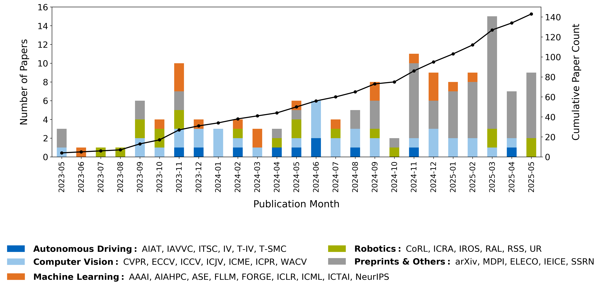

# Foundation Models in Autonomous Driving: A Dual Survey on Scenario Generation and Scenario Analysis :car:
<div align="center">
<a href="https://example.com/paper-to-be-published"></a>
<a href="https://github.com/TUM-AVS/FM-AV-Survey-Scenario-Generation-Analysis/stargazers"></a>
<a href="https://github.com/TUM-AVS/FM-AV-Survey-Scenario-Generation-Analysis/network/members"></a>
<a href="https://github.com/TUM-AVS/FM-AV-Survey-Scenario-Generation-Analysis/pulls"></a>
<a href="https://github.com/TUM-AVS/FM-AV-Survey-Scenario-Generation-Analysis/issues"></a>
<a href="https://github.com/TUM-AVS/FM-AV-Survey-Scenario-Generation-Analysis/blob/main/LICENSE"></a>
</div>

This repository will collect research, implementations, and resources related to **Foundation Models for Scenario Generation and Analysis** in autonomous driving. The repository will be maintained by [TUM-AVS](https://www.mos.ed.tum.de/avs/startseite/) (Professorship of Autonomous Vehicle Systems at Technical University of Munich) and will be continuously updated to track the latest work in the community.

**Keywords:**
- **Foundation Model Types:** Foundation Models, Large Language Models (LLMs), Vision-Language Models (VLMs), Multimodal Large Language Models (MLLMs), Diffusion Models (DMs), World Models (WMs), Generative Models (GMs)
- **Scenario Generation & Analysis:** Scenario Generation, Scenario Simulation, Traffic Simulation, Scenario Testing, Scenario Understanding, Driving Scene Generation, Scene Reasoning, Risk Assessment, Safety-Critical Scenarios, Accident Prediction
- **Application Context:** Autonomous Driving, Self-Driving Vehicles, AV Simulation, Driving Video Generation, Traffic Datasets, Closed-Loop Simulation, Safety Assurance

<p align="center">

</p>

## :fire: Updates
- [May.2024] Repository initialized

## 🤝 &nbsp; Citation
Please visit [Foundation Models in Autonomous Driving: A Dual Survey on Scenario Generation and Scenario Analysis](https://example.com/paper-to-be-published) for more details and comprehensive information (coming soon). If you find our paper and repo helpful, please consider citing it as follows:

```BibTeX
@article{Foundation-Models-AV-Dual-Survey,
  author={TBD},
  title={Foundation Models in Autonomous Driving: A Dual Survey on Scenario Generation and Scenario Analysis},
  journal={TBD},
  year={2024},
  pages={TBD},
  doi={TBD}
}
```

## :page_with_curl: Introduction
Foundation models are large-scale, pre-trained models that can be adapted to a wide range of downstream tasks. In the context of autonomous driving, foundation models offer a powerful approach to scenario generation and analysis, enabling more comprehensive and realistic testing, validation, and verification of autonomous driving systems. This repository aims to collect and organize research, tools, and resources in this important field.

<p align="center">

</p>

## :chart_with_upwards_trend: Publication Timeline
The following figure shows the evolution of foundation model research in autonomous driving scenario generation and analysis over time:

<p align="center">

</p>

## 🌟 Diffusion Models for Autonomous Driving

| Paper | Date | Venue | Code | Application |
|:------|:-----|:------|:-----|:------------|
| [Guided Conditional Diffusion for Controllable Traffic Simulation](https://aiasd.github.io/ctg.github.io/) | 2022-10 | ICRA 2023 | [GitHub](https://github.com/NVlabs/CTG) | Scenario Generation |
| [Generating Driving Scenes with Diffusion](https://arxiv.org/abs/2305.18452) | 2023-05 | arXiv | - | Scenario Generation |
| [DiffScene: Guided Diffusion Models for Safety-Critical Scenario Generation](https://openreview.net/forum?id=hclEbdHida) | 2023-06 | AdvML-Frontiers 2023 | - | Scenario Generation |
| [BEVControl: Accurately Controlling Street-view Elements with Multi-perspective Consistency via BEV Sketch Layout](https://arxiv.org/abs/2308.01661) | 2023-09 | arXiv | - | Scenario Generation |
| [DriveSceneGen: Generating Diverse and Realistic Driving Scenarios From Scratch](https://arxiv.org/abs/2309.14685) | 2023-09 | IEEE Robotics and Automation Letters 2024 | - | Scenario Generation |
| [MagicDrive: Street View Generation with Diverse 3D Geometry Control](https://arxiv.org/abs/2310.02601) | 2023-10 | ICLR 2024 | [GitHub](https://github.com/cure-lab/MagicDrive) | Scenario Generation |
| [DrivingDiffusion: Layout-Guided multi-view driving scene video generation with latent diffusion model](https://arxiv.org/abs/2310.07771) | 2023-10 | ECCV 2024 | - | Scenario Generation |
| [Language-guided traffic simulation via scene-level diffusion](https://research.nvidia.com/labs/avg/publication/zhong.rempe.etal.corl23/) | 2023-11 | CoRL 2023 | - | Scenario Generation |
| [Scenario Diffusion: Controllable Driving Scenario Generation With Diffusion](https://neurips.cc/virtual/2023/poster/72611) | 2023-11 | NeurIPS 2023 | - | Scenario Generation |
| [Panacea: Panoramic and Controllable Video Generation for Autonomous Driving](https://arxiv.org/abs/2311.16813) | 2023-11 | CVPR 2024 | [GitHub](https://github.com/wenyuqing/panacea) | Scenario Generation |
| [SAFE-SIM: Safety-Critical Closed-Loop Traffic Simulation with Diffusion-Controllable Adversaries](https://www.ecva.net/papers/eccv_2024/papers_ECCV/papers/03157-supp.pdf) | 2023-12 | ECCV 2024 | [GitHub](https://github.com/jxmmy7777/safe-sim) | Scenario Generation |
| [Text2Street: Controllable Text-to-image Generation for Street Views](https://arxiv.org/abs/2402.04504) | 2024-02 | ICPR 2024 | - | Scenario Generation |
| [GEODIFFUSION: Text-Prompted Geometric Control for Object Detection Data Generation](https://arxiv.org/pdf/2306.04607) | 2024-02 | ICLR 2024 | [GitHub](https://kaichen1998.github.io/projects/geodiffusion/) | Scenario Generation |
| [GenDDS: Generating Diverse Driving Video Scenarios with Prompt-to-Video Generative Model](https://arxiv.org/abs/2408.15868) | 2024-04 | ITSC 2024 | - | Scenario Generation |
| [Versatile Behavior Diffusion for Generalized Traffic Agent Simulation](https://arxiv.org/abs/2404.02524) | 2024-04 | RSS 2024 | [GitHub](https://github.com/SafeRoboticsLab/VBD) | Scenario Generation |
| [SceneControl: Diffusion for Controllable Traffic Scene Generation](https://waabi.ai/scenecontrol/) | 2024-05 | ICRA 2024 | - | Scenario Generation |
| [DrivingGen: Efficient Safety-Critical Driving Video Generation with Latent Diffusion Models](https://ieeexplore.ieee.org/document/10688119) | 2024-07 | ICME 2024 | - | Scenario Generation |
| [SLEDGE: Synthesizing Driving Environments with Generative Models and Rule-Based Traffic](https://arxiv.org/abs/2403.17933) | 2024-07 | ECCV 2024 | [GitHub](https://github.com/autonomousvision/sledge) | Scenario Generation |
| [Data-driven Diffusion Models for Enhancing Safety in Autonomous Vehicle Traffic Simulations](https://arxiv.org/abs/2410.04809) | 2024-10 | arXiv | - | Scenario Generation |
| [AdvDiffuser: Generating Adversarial Safety-Critical Driving Scenarios via Guided Diffusion](https://ieeexplore.ieee.org/abstract/document/10802408) | 2024-10 | IROS 2023 | - | Scenario Generation |
| [DiffRoad: Realistic and Diverse Road Scenario Generation for Autonomous Vehicle Testing](https://arxiv.org/abs/2411.09451) | 2024-11 | arXiv | - | Scenario Generation |
| [SceneDiffuser: Efficient and Controllable Driving Simulation Initialization and Rollout](https://arxiv.org/pdf/2412.12129) | 2024-12 | NeurIPS 2024 | [GitHub](https://scenediffuser.github.io/) | Scenario Generation |
| [Direct Preference Optimization-Enhanced Multi-Guided Diffusion Model for Traffic Scenario Generation](https://arxiv.org/abs/2502.12178) | 2025-02 | arXiv | - | Scenario Generation |
| [Causal Composition Diffusion Model for Closed-loop Traffic Generation](https://arxiv.org/abs/2412.17920) | 2025-02 | arXiv | - | Scenario Generation |
| [AVD2: Accident Video Diffusion for Accident Video Description](https://arxiv.org/pdf/2502.14801) | 2025-03 | ICRA 2025 | [GitHub](https://github.com/An-Answer-tree/AVD2) | Scenario Generation, Scenario Analysis |
| [DualDiff+: Dual-Branch Diffusion for High-Fidelity Video Generation with Reward Guidance](https://arxiv.org/abs/2503.03689) | 2025-03 | arXiv | - | Scenario Generation |
| [DriveGen: Towards Infinite Diverse Traffic Scenarios with Large Models](https://arxiv.org/abs/2503.05808) | 2025-03 | arXiv | - | Scenario Generation |
| [Scenario Dreamer: Vectorized Latent Diffusion for Generating Driving Simulation Environments](https://arxiv.org/abs/2503.22496) | 2025-03 | arXiv | - | Scenario Generation |
| [DiVE: Efficient Multi-View Driving Scenes Generation Based on Video Diffusion Transformer](https://arxiv.org/abs/2504.DiVE) | 2025-04 | arXiv | - | Scenario Generation |
| [DualDiff: Dual-branch Diffusion Model for Autonomous Driving with Semantic Fusion](https://www.arxiv.org/abs/2505.01857) | 2025-05 | arXiv | - | Scenario Generation |
| [Dual-Conditioned Temporal Diffusion Modeling for Driving Scene Generation](https://zzzura-secure.duckdns.org/dctdm) | 2025-05 | ICAR 2025 | [GitHub](https://github.com/PeteBai/DcTDM) | Scenario Generation |
| [LD-Scene: LLM-Guided Diffusion for Controllable Generation of Adversarial Safety-Critical Driving Scenarios](https://arxiv.org/abs/2505.LD-Scene) | 2025-05 | arXiv | - | Scenario Generation |

## 🌟 Large Language Models for Autonomous Driving

### Scenario Generation (LLM)

| Paper | Date | Venue | Code | 
|:------|:-----|:------|:-----|
| [ChatScene: Knowledge-Enabled Safety-Critical Scenario Generation for Autonomous Vehicles](https://arxiv.org/abs/2405.14062) | 2024-05 | ECCV 2024 | - |
| [LLMDrive: Closed-Loop End-to-End Driving with Large Language Models](https://arxiv.org/abs/2312.07488) | 2024-07 | CVPR 2024 | [GitHub](https://github.com/opendilab/LMDrive) |
| [DiLu: A Knowledge-Driven Approach to Autonomous Driving with Large Language Models](https://arxiv.org/abs/2309.16292) | 2024-09 | ICLR 2024 | [GitHub](https://pjlab-adg.github.io/DiLu_Page/) |
| [Agent Driver: A Conversational LLM Framework for Human-Vehicle Interaction](https://ieeexplore.ieee.org/document/10640507) | 2024-10 | IV 2024 | - |
| [Feasibility and Acceptability of Language Model Agent for Negotiation in Traffic](https://arxiv.org/abs/2410.05008) | 2024-10 | arXiv | - |
| [LLM-Drive: Closed-loop End-to-end Driving with Large Language Models](https://github.com/henrique111222333/LLMDrive) | 2024-11 | - | [GitHub](https://github.com/henrique111222333/LLMDrive) |
| [Drive-by-LLM: Leveraging Large Language Models for Safe and Efficient Autonomous Driving](https://scholar.google.com/citations?view_op=view_citation&hl=en&user=YOUR_USER_ID&citation_for_view=YOUR_USER_ID:citation_id) | 2024-12 | - | - |

### Scenario Analysis (LLM)

| Paper | Date | Venue | Code |
|:------|:-----|:------|:-----|
| [A Closer Look at the Self-Verification Abilities of Large Language Models in Logical Reasoning](https://arxiv.org/abs/2311.07954) | 2023-11 | arXiv | - |
| [Drive Like a Human: Rethinking Autonomous Driving with Large Language Models](https://arxiv.org/abs/2307.07162) | 2024-02 | WACV 2024 | [GitHub](https://github.com/PJLab-ADG/DriveLikeAHuman) |
| [Traffic Safety Assessment in Real-Time Using Large Language Model](https://arxiv.org/abs/2402.15044) | 2024-02 | arXiv | - |
| [LLM-AD: Large Language Model for Autonomous Driving](https://arxiv.org/abs/2405.13495) | 2024-05 | arXiv | - |
| [Safety-Critical Scenario Generation for Autonomous Vehicles Using Large Language Models](https://arxiv.org/abs/2404.03762) | 2024-05 | IV 2024 | - |
| [Can Large Language Models Understand and Answer Questions About Vehicle Dynamics?](https://arxiv.org/abs/2403.05015) | 2024-06 | ITSC 2024 | - |
| [DriveLM: Driving with Graph Visual Question Answering](https://arxiv.org/abs/2312.14150) | 2024-06 | ECCV 2024 | [GitHub](https://github.com/OpenDriveLab/DriveLM) |
| [Evaluating LLMs for Incident Response at Scale](https://arxiv.org/abs/2405.00476) | 2024-07 | arXiv | - |
| [Multi-modal Large Language Model Driven Scenario Testing for Autonomous Vehicles](https://arxiv.org/abs/2408.01699) | 2024-08 | arXiv | - |
| [LLM-AD: Large Language Model for Autonomous Driving](https://arxiv.org/abs/2405.13495) | 2024-09 | arXiv | - |
| [MotionLLM: Multimodal Motion-Language Reasoning](https://arxiv.org/abs/2405.17013) | 2024-10 | NeurIPS 2024 | [GitHub](https://github.com/IDEA-Research/MotionLLM) |
| [V2Xum-LLM: Cross-Modal Video Summarization with Temporal Prompt Instruction Tuning](https://arxiv.org/abs/2404.12353) | 2024-10 | arXiv | - |
| [Large Language Models for Autonomous Driving: Real-World Case Studies and Performance Benchmarks](https://arxiv.org/abs/2411.19751) | 2024-11 | arXiv | - |
| [LangSurf: Language-Embedded Surface Gaussians for 3D Scene Understanding](https://arxiv.org/abs/2411.17635) | 2024-12 | NeurIPS 2024 | [GitHub](https://github.com/LangSurf/LangSurf) |

## 🌟 Multimodal Large Language Models for Autonomous Driving

### Scenario Generation (MLLM)

| Paper | Date | Venue | Code |
|:------|:-----|:------|:-----|
| [GPT-Driver: Learning to Drive with GPT](https://arxiv.org/abs/2310.01415) | 2023-10 | arXiv | - |
| [LMDrive: Closed-Loop End-to-End Driving with Large Language Models](https://arxiv.org/abs/2312.07488) | 2023-12 | CVPR 2024 | [GitHub](https://github.com/opendilab/LMDrive) |
| [DriveMLM: Aligning Multi-Modal Large Language Models with Behavioral Planning States for Autonomous Driving](https://arxiv.org/abs/2312.09245) | 2023-12 | arXiv | [GitHub](https://github.com/OpenGVLab/DriveMLM) |
| [On the Road with GPT-4V(ision): Early Explorations of Visual-Language Model on Autonomous Driving](https://arxiv.org/abs/2311.05332) | 2023-12 | CVPR Workshop 2024 | [GitHub](https://github.com/PJLab-ADG/GPT4V-AD-Exploration) |
| [DriveLM: Driving with Graph Visual Question Answering](https://arxiv.org/abs/2312.14150) | 2023-12 | ECCV 2024 | [GitHub](https://github.com/OpenDriveLab/DriveLM) |
| [LingoQA: Video Question Answering for Autonomous Driving](https://arxiv.org/abs/2312.14115) | 2023-12 | arXiv | [GitHub](https://github.com/wayveai/LingoQA) |
| [DriveVLM: The Convergence of Autonomous Driving and Large Vision-Language Models](https://arxiv.org/abs/2402.12289) | 2024-02 | arXiv | - |
| [Drive Like a Human: Rethinking Autonomous Driving with Large Language Models](https://arxiv.org/abs/2307.07162) | 2024-02 | WACV 2024 | [GitHub](https://github.com/PJLab-ADG/DriveLikeAHuman) |
| [Dolphins: Multimodal Language Model for Driving](https://arxiv.org/abs/2312.00438) | 2024-03 | arXiv | [GitHub](https://github.com/SaFoLab-WISC/Dolphins) |
| [DRAMA: Joint Risk Localization and Captioning for Autonomous Driving](https://arxiv.org/abs/2312.13677) | 2024-03 | WACV 2024 | - |
| [RAG-Driver: Generalisable Driving Explanations with Retrieval-Augmented In-Context Learning in Multi-Modal Large Language Model](https://arxiv.org/abs/2402.10828) | 2024-04 | arXiv | - |
| [Talk2BEV: Language-Enhanced Bird's-Eye View Maps for Autonomous Driving](https://arxiv.org/abs/2310.02251) | 2024-04 | arXiv | - |
| [DrivingCoT: Chain-of-Thought Reasoning for Autonomous Driving with Large Language Models](https://arxiv.org/abs/2403.16996) | 2024-04 | arXiv | - |
| [DriveGenVLM: Real-world Video Generation for Vision Language Model based Autonomous Driving](https://arxiv.org/abs/2408.16300) | 2024-08 | arXiv | - |
| [Vision Language Models Can Parse Floor Plan Maps](https://arxiv.org/abs/2407.12482) | 2024-09 | IROS 2024 | - |
| [DriveCoT: Integrating Chain-of-Thought Reasoning with End-to-End Driving](https://arxiv.org/abs/2403.16996) | 2024-11 | arXiv | - |

### Scenario Analysis (MLLM)

| Paper | Date | Venue | Code |
|:------|:-----|:------|:-----|
| [A Vision-Language Foundation Model for Autonomous Driving](https://arxiv.org/abs/2405.17197) | 2024-05 | arXiv | - |
| [SafeEmbodAI: a Safety Framework for Mobile Robots in Human Environments](https://arxiv.org/abs/2405.17197) | 2024-05 | arXiv | - |
| [MotionLLM: Multimodal Motion-Language Reasoning](https://arxiv.org/abs/2405.17013) | 2024-05 | NeurIPS 2024 | [GitHub](https://github.com/IDEA-Research/MotionLLM) |
| [V2Xum-LLM: Cross-Modal Video Summarization with Temporal Prompt Instruction Tuning](https://arxiv.org/abs/2404.12353) | 2024-06 | arXiv | - |
| [Can Vision-Language Models Understand Real-World Complex Visual Questions?](https://arxiv.org/abs/2406.12479) | 2024-08 | arXiv | - |
| [Multi-modal Large Language Model Driven Scenario Testing for Autonomous Vehicles](https://arxiv.org/abs/2408.01699) | 2024-08 | arXiv | - |
| [Cognitive Kernel: An Open-source Agent System towards Generalist Autopilots](https://arxiv.org/abs/2409.10277) | 2024-09 | arXiv | [GitHub](https://github.com/tsinghua-fib-lab/CognitiveKernel) |
| [VisionZip: Longer is Better But Not Necessary in Vision Language Models](https://arxiv.org/abs/2404.06865) | 2024-09 | EMNLP 2024 | [GitHub](https://github.com/dvlab-research/VisionZip) |
| [Multi-Agent Large Language Model for Autonomous Driving Safety-Critical Edge Case Generation](https://arxiv.org/abs/2409.11850) | 2024-10 | arXiv | - |
| [LangSurf: Language-Embedded Surface Gaussians for 3D Scene Understanding](https://arxiv.org/abs/2411.17635) | 2024-11 | NeurIPS 2024 | [GitHub](https://github.com/LangSurf/LangSurf) |

## 🌟 Vision-Language Models for Autonomous Driving

### Scenario Generation (VLM)

| Paper | Date | Venue | Code |
|:------|:-----|:------|:-----|
| [Learning to Prompt for Open-Vocabulary Object Detection with Vision-Language Model](https://openaccess.thecvf.com/content/CVPR2022/papers/Du_Learning_To_Prompt_for_Open-Vocabulary_Object_Detection_With_Vision-Language_Model_CVPR_2022_paper.pdf) | 2022-06 | CVPR 2022 | [GitHub](https://github.com/dyabel/detpro) |
| [Visual Instruction Tuning](https://arxiv.org/abs/2304.08485) | 2023-04 | NeurIPS 2023 | [GitHub](https://github.com/haotian-liu/LLaVA) |
| [NuInstruct: A Multi-Modal Dataset for Teaching Object Localization in Autonomous Driving](https://arxiv.org/abs/2401.02335) | 2024-01 | CVPR 2024 | [GitHub](https://github.com/xmed-lab/NuInstruct) |
| [DriveLM: Driving with Graph Visual Question Answering](https://arxiv.org/abs/2312.14150) | 2024-03 | ECCV 2024 | [GitHub](https://github.com/OpenDriveLab/DriveLM) |
| [RAG-Driver: Generalisable Driving Explanations with Retrieval-Augmented In-Context Learning in Multi-Modal Large Language Model](https://arxiv.org/abs/2402.10828) | 2024-04 | arXiv | - |
| [DrivingCoT: Chain-of-Thought Reasoning for Autonomous Driving with Large Language Models](https://arxiv.org/abs/2403.16996) | 2024-04 | arXiv | - |
| [DriveLM: Driving with Graph Visual Question Answering](https://arxiv.org/abs/2312.14150) | 2024-06 | ECCV 2024 | [GitHub](https://github.com/OpenDriveLab/DriveLM) |

### Scenario Analysis (VLM)

| Paper | Date | Venue | Code |
|:------|:-----|:------|:-----|
| [CLIP-AD: A Language-Guided Staged Dual-Path Model for Zero-shot Anomaly Detection](https://arxiv.org/abs/2311.00453) | 2023-11 | arXiv | - |
| [TransDETR: Temporally Correlated Transformers for Multi-frame Detection in Videos](https://arxiv.org/abs/2401.06294) | 2024-01 | arXiv | - |
| [Vision Language Models Can Parse Floor Plan Maps](https://arxiv.org/abs/2407.12482) | 2024-07 | IROS 2024 | - |
| [Multi-modal Large Language Model Driven Scenario Testing for Autonomous Vehicles](https://arxiv.org/abs/2408.01699) | 2024-08 | arXiv | - |
| [VisionZip: Longer is Better But Not Necessary in Vision Language Models](https://arxiv.org/abs/2404.06865) | 2024-09 | EMNLP 2024 | [GitHub](https://github.com/dvlab-research/VisionZip) |
| [LangSurf: Language-Embedded Surface Gaussians for 3D Scene Understanding](https://arxiv.org/abs/2411.17635) | 2024-11 | NeurIPS 2024 | [GitHub](https://github.com/LangSurf/LangSurf) |

## 🌟 World Models for Autonomous Driving

### Scenario Generation (WM)

| Paper | Date | Venue | Code |
|:------|:-----|:------|:-----|
| [MUVO: A Multimodal World Model for Autonomous Driving with Geometric Representations](https://arxiv.org/abs/2311.11762) | 2023-11 | ICRA 2024 | [GitHub](https://github.com/cfzd/MUVO) |
| [ADriver-I: A General World Model for Autonomous Driving](https://arxiv.org/abs/2311.13549) | 2023-11 | arXiv | - |
| [GenAD: Generalized Predictive Model for Autonomous Driving](https://arxiv.org/abs/2403.09630) | 2024-03 | CVPR 2024 | [GitHub](https://github.com/OpenDriveLab/GenAD) |
| [DriveDreamer: Towards Real-world-driven World Models for Autonomous Driving](https://arxiv.org/abs/2309.09777) | 2024-05 | ECCV 2024 | [GitHub](https://github.com/JeffWang987/DriveDreamer) |
| [OccWorld: Learning a 3D Occupancy World Model for Autonomous Driving](https://arxiv.org/abs/2311.16038) | 2024-05 | ECCV 2024 | [GitHub](https://github.com/wzzheng/OccWorld) |
| [DriveDreamer-2: LLM-Enhanced World Models for Diverse Driving Video Generation](https://arxiv.org/abs/2403.06845) | 2024-05 | arXiv | [GitHub](https://github.com/f1yfisher/DriveDreamer2) |
| [Editable Scene Simulation for Autonomous Driving via Collaborative LLM-Agents](https://arxiv.org/abs/2402.05746) | 2024-06 | CVPR 2024 | [GitHub](https://github.com/yifanlu0227/ChatSim) |
| [Vista: A Generalizable Driving World Model with High Fidelity and Versatile Controllability](https://arxiv.org/abs/2405.17398) | 2024-08 | NeurIPS 2024 | [GitHub](https://github.com/OpenDriveLab/Vista) |
| [DriveMLM: Aligning Multi-Modal Large Language Models with Behavioral Planning States for Autonomous Driving](https://arxiv.org/abs/2312.09245) | 2024-10 | arXiv | [GitHub](https://github.com/OpenGVLab/DriveMLM) |
| [Copilot4D: Learning Unsupervised World Models for Autonomous Driving via Discrete Diffusion](https://arxiv.org/abs/2311.01017) | 2024-10 | ICLR 2024 | [GitHub](https://github.com/liyunsheng13/copilot4d) |
| [GAIA-1: A Generative World Model for Autonomous Driving](https://arxiv.org/abs/2309.17080) | 2024-11 | arXiv | - |
| [Holistic Autonomous Driving Understanding by Bird's-Eye-View Injected Multi-Modal Large Models](https://arxiv.org/abs/2401.02335) | 2024-11 | CVPR 2024 | [GitHub](https://github.com/xmed-lab/NuInstruct) |

### Scenario Analysis (WM)

| Paper | Date | Venue | Code |
|:------|:-----|:------|:-----|
| [Learning Interactive Driving Policies via Data-driven Simulation](https://arxiv.org/abs/2111.12732) | 2022-04 | ICRA 2022 | [GitHub](https://github.com/Tsinghua-MARS-Lab/InterSim) |
| [Learning from All Vehicles](https://openaccess.thecvf.com/content/CVPR2022/papers/Qi_Learning_From_All_Vehicles_CVPR_2022_paper.pdf) | 2022-06 | CVPR 2022 | [GitHub](https://github.com/dotchen/LAV) |
| [ST-P3: End-to-end Vision-based Autonomous Driving via Spatial-Temporal Feature Learning](https://arxiv.org/abs/2207.07601) | 2022-07 | ECCV 2022 | [GitHub](https://github.com/OpenPerceptionX/ST-P3) |
| [Model-Based Imitation Learning for Urban Driving](https://arxiv.org/abs/2210.07729) | 2022-10 | NeurIPS 2022 | [GitHub](https://github.com/autonomousvision/mile) |
| [Drive as You Speak: Enabling Human-Like Interaction with Large Language Models in Autonomous Vehicles](https://arxiv.org/abs/2309.10228) | 2023-09 | WACV 2024 | - |
| [Generative Modeling of Autonomous Driving Trajectories](https://arxiv.org/abs/2309.07910) | 2023-09 | ICLR 2024 | [GitHub](https://github.com/Shaosifan/TrafficGEN) |
| [CoWorld: Decoupled Generation for Autonomous Driving using Pre-trained Foundation Models](https://arxiv.org/abs/2309.17080) | 2023-09 | arXiv | - |
| [DrivingDojo: Synthesizing Realistic and Diverse Driving Scenarios for Safety-Critical Learning](https://arxiv.org/abs/2402.16329) | 2024-02 | ICRA 2024 | [GitHub](https://github.com/autonomousvision/driving_dojo) |
| [DIVA: A Disentangled World Model for Autonomous Driving](https://arxiv.org/abs/2302.12635) | 2024-05 | ICCV 2023 | - |
| [CAT: Closed-loop Adversarial Training for Safe End-to-End Driving](https://arxiv.org/abs/2310.12432) | 2024-05 | RSS 2024 | [GitHub](https://github.com/georgeliu233/CAT) |
| [WorldModel: A Foundation Model for Autonomous Driving](https://arxiv.org/abs/2403.04878) | 2024-08 | arXiv | - |
| [OccSora: 4D Occupancy Generation Models as World Simulators for Autonomous Driving](https://arxiv.org/abs/2405.20337) | 2024-09 | arXiv | [GitHub](https://github.com/wzzheng/OccSora) |

## 🌟 Datasets Comparison

| Dataset | Year | Img | View | Real | Lidar | Radar | Traj | 3D | 2D | Lane | Weather | Time | Region | Company |
|:--------|:-----|:----|:-----|:-----|:------|:------|:-----|:---|:---|:-----|:--------|:-----|:-------|:--------|
| CamVid | 2009 | RGB | FPV | ✅ | ❌ | ❌ | ❌ | ❌ | ✅ | ✅ | ✅ | D | U | - |
| KITTI | 2013 | RGB/S | FPV | ✅ | ✅ | ❌ | ✅ | ✅ | ✅ | ✅ | ✅ | D | U/R/H | - |
| Cyclists | 2016 | RGB | FPV | ✅ | ❌ | ❌ | ❌ | ❌ | ❌ | ❌ | ❌ | D | U | - |
| Cityscapes | 2016 | RGB/S | FPV | ✅ | ❌ | ❌ | ❌ | ✅ | ✅ | ✅ | ❌ | D | U | - |
| SYNTHIA | 2016 | RGB | FPV | ❌ | ❌ | ❌ | ❌ | ✅ | ✅ | ✅ | ✅ | D/N | U | - |
| Campus | 2016 | RGB | BEV | ❌ | ❌ | ❌ | ❌ | ❌ | ❌ | ❌ | ❌ | D | C | - |
| RobotCar | 2016 | RGB | FPV | ✅ | ❌ | ❌ | ❌ | ❌ | ❌ | ❌ | ❌ | D/N | U | - |
| Mapillary | 2017 | RGB | FPV | ✅ | ❌ | ❌ | ❌ | ❌ | ✅ | ✅ | ✅ | D/N | U | - |
| P.F.B. | 2017 | RGB | FPV | ✅ | ❌ | ❌ | ❌ | ❌ | ✅ | ✅ | ✅ | D/N | U | - |
| BDD100K | 2018 | RGB | FPV | ✅ | ❌ | ❌ | ❌ | ✅ | ✅ | ✅ | ✅ | D | U/H | - |
| HighD | 2018 | RGB | BEV | ✅ | ❌ | ❌ | ❌ | ❌ | ✅ | ✅ | ❌ | D | H | - |
| Udacity | 2018 | RGB | FPV | ✅ | ❌ | ❌ | ❌ | ❌ | ❌ | ❌ | ❌ | D | U | - |
| KAIST | 2018 | RGB/S | FPV | ✅ | ✅ | ❌ | ❌ | ❌ | ✅ | ✅ | ✅ | D/N | U | - |
| Argoverse | 2019 | RGB/S | FPV | ✅ | ✅ | ❌ | ❌ | ❌ | ✅ | ✅ | ✅ | D/N | U | - |
| TRAF | 2019 | RGB | FPV | ✅ | ❌ | ❌ | ❌ | ❌ | ✅ | ✅ | ✅ | D | U | - |
| ApolloScape | 2019 | RGB/S | FPV | ✅ | ❌ | ❌ | ❌ | ✅ | ✅ | ✅ | ✅ | D | U | - |
| ACFR | 2019 | RGB | BEV | ✅ | ❌ | ❌ | ❌ | ❌ | ❌ | ❌ | ❌ | D | RA | - |
| H3D | 2019 | RGB | FPV | ✅ | ❌ | ❌ | ❌ | ❌ | ✅ | ✅ | ✅ | D | U | - |
| INTERACTION | 2019 | RGB | BEV | ✅ | ❌ | ❌ | ❌ | ❌ | ❌ | ❌ | ❌ | D | I/RA | - |
| Comma2k19 | 2019 | RGB | FPV | ✅ | ❌ | ❌ | ✅ | ✅ | ❌ | ❌ | ❌ | D/N | U/S/R/H | - |
| InD | 2020 | RGB | BEV | ✅ | ❌ | ❌ | ❌ | ❌ | ❌ | ❌ | ❌ | D | I | - |
| RounD | 2020 | RGB | BEV | ✅ | ❌ | ❌ | ❌ | ❌ | ❌ | ❌ | ❌ | D | RA | - |
| nuScenes | 2020 | RGB | FPV | ✅ | ✅ | ✅ | ❌ | ✅ | ✅ | ✅ | ✅ | D/N | U | - |
| Lyft Level 5 | 2020 | RGB | FPV | ✅ | ✅ | ✅ | ❌ | ✅ | ✅ | ✅ | ✅ | D/N | U/S | - |
| Waymo Open | 2020 | RGB | FPV | ✅ | ✅ | ✅ | ✅ | ✅ | ✅ | ✅ | ✅ | D/N | U | - |
| A*3D | 2020 | RGB | FPV | ✅ | ✅ | ✅ | ✅ | ✅ | ✅ | ✅ | ✅ | D/N | U | - |
| RobotCar Radar | 2020 | RGB | FPV | ✅ | ✅ | ✅ | ✅ | ✅ | ✅ | ✅ | ✅ | D/N | U | - |
| Toronto3D | 2020 | RGB | BEV | ✅ | ✅ | ❌ | ✅ | ✅ | ❌ | ✅ | ❌ | D/N | U | University of Waterloo |
| A2D2 | 2020 | RGB | FPV | ✅ | ✅ | ✅ | ✅ | ✅ | ✅ | ❌ | ✅ | ✅ | D | U/H/S/R | Audi |
| WADS | 2020 | RGB | FPV | ✅ | ✅ | ✅ | ✅ | ✅ | ❌ | ❌ | ✅ | D/N | U/S/R | Michigan Technological University |
| Argoverse 2 | 2021 | RGB/S | FPV | ✅ | ✅ | ❌ | ❌ | ✅ | ✅ | ✅ | ✅ | D/N | U | - |
| PandaSet | 2021 | RGB | FPV | ✅ | ✅ | ✅ | ✅ | ✅ | ✅ | ✅ | ✅ | D/N | U | - |
| ONCE | 2021 | RGB | FPV | ✅ | ✅ | ✅ | ✅ | ✅ | ✅ | ✅ | ✅ | D/N | U | - |
| Leddar PixSet | 2021 | RGB | FPV | ✅ | ✅ | ❌ | ✅ | ✅ | ✅ | ❌ | ✅ | D/N | U/S/R | Leddar |
| ZOD | 2022 | RGB | FPV | ✅ | ✅ | ✅ | ✅ | ✅ | ✅ | ✅ | ✅ | D/N | U/R/S/H | Zenseact |
| IDD-3D | 2022 | RGB | FPV | ✅ | ✅ | ❌ | ❌ | ✅ | ✅ | ❌ | ❌ | - | R | INAI |
| CODA | 2022 | RGB | FPV | ✅ | ✅ | ✅ | ✅ | ✅ | ✅ | ✅ | ✅ | D/N | U/S/R | Huawei |
| SHIFT | 2022 | RGB | FPV | ✅ | ✅ | ✅ | ✅ | ✅ | ✅ | ✅ | ✅ | D/N | U/S/R/H | ETH Zürich |
| DeepAccident | 2023 | RGB/S | FPV/BEV | ❌ | ✅ | ❌ | ❌ | ✅ | ✅ | ✅ | ✅ | D/N | U/S/R/H | HKU, Huawei, CARLA |
| Dual_Radar | 2023 | RGB | FPV | ✅ | ✅ | ✅ | ✅ | ✅ | ❌ | ✅ | ✅ | D/N | U | Tsinghua University |
| V2V4Real | 2023 | RGB | FPV | ✅ | ✅ | ❌ | ✅ | ✅ | ❌ | ✅ | ❌ | - | U/H/S | UCLA Mobility Lab |
| SCaRL | 2024 | RGB/S | FPV/BEV | ❌ | ✅ | ✅ | ✅ | ✅ | ✅ | ✅ | ✅ | D/N | U/S/R/H | Fraunhofer CARLA |
| MARS | 2024 | RGB | FPV | ✅ | ✅ | ✅ | ✅ | ✅ | ✅ | ✅ | ✅ | D/N | U/S/H | NYU, MAY Mobility |
| Scenes101 | 2024 | RGB | FPV | ✅ | ❌ | ❌ | ✅ | ❌ | ❌ | ✅ | ✅ | D/N | U/S/R/H | Wayve |
| TruckScenes | 2025 | RGB | FPV | ✅ | ✅ | ✅ | ✅ | ✅ | ❌ | ✅ | ✅ | D/N | H/U | MAN |

*Notes: View: FPV=First-Person, BEV=Bird's-Eye; Time: D=Day, N=Night; Region: U=Urban, R=Rural, H=Highway, S=Suburban, C=Campus, I=Intersection, RA=Road Area; Img: RGB/S=RGB+Stereo*


## 🌟 Simulators

| Simulator | Year | Back-end | Open Source | Realistic Perception | Custom Scenario | Real World Map | Human Design Map | Python API | C++ API | ROS API | Company |
|:----------|:-----|:---------|:------------|:---------------------|:----------------|:---------------|:-----------------|:-----------|:--------|:--------|:--------|
| TORCS | 2000 | None | ✅ | ✅ | ✅ | ❌ | ❌ | ❌ | ❌ | ❌ | - |
| Webots | 2004 | ODE | ✅ | ✅ | ✅ | ✅ | ❌ | ✅ | ✅ | ❌ | - |
| CarRacing | 2017 | None | ✅ | ❌ | ❌ | ❌ | ✅ | ✅ | ❌ | ❌ | - |
| CARLA | 2017 | UE4 | ✅ | ✅ | ✅ | ❌ | ✅ | ✅ | ✅ | ✅ | - |
| SimMobilityST | 2017 | None | ✅ | ❌ | ❌ | ❌ | ❌ | ❌ | ❌ | ❌ | - |
| GTA-V | 2017 | RAGE | ❌ | ✅ | ❌ | ❌ | ❌ | ❌ | ❌ | ❌ | - |
| highway-env | 2018 | None | ✅ | ❌ | ✅ | ❌ | ✅ | ✅ | ❌ | ❌ | - |
| Deepdrive | 2018 | UE4 | ✅ | ✅ | ✅ | ❌ | ✅ | ✅ | ✅ | ❌ | - |
| esmini | 2018 | Unity | ✅ | ❌ | ❌ | ❌ | ❌ | ✅ | ❌ | ❌ | - |
| AutonoViSim | 2018 | PhysX | ❌ | ✅ | ✅ | ❌ | ❌ | ✅ | ❌ | ❌ | - |
| AirSim | 2018 | UE4 | ✅ | ✅ | ✅ | ❌ | ✅ | ✅ | ✅ | ❌ | - |
| SUMO | 2018 | None | ✅ | ❌ | ✅ | ✅ | ✅ | ❌ | ✅ | ❌ | - |
| Apollo | 2018 | Unity | ✅ | ✅ | ✅ | ✅ | ✅ | ✅ | ✅ | ❌ | - |
| Sim4CV | 2018 | UE4 | ✅ | ✅ | ✅ | ❌ | ✅ | ✅ | ❌ | ❌ | - |
| MATLAB | 2018 | MATLAB | ❌ | ✅ | ✅ | ✅ | ✅ | ✅ | ✅ | ✅ | Mathworks |
| Scenic | 2019 | None | ✅ | ✅ | ✅ | ✅ | ✅ | ✅ | ❌ | ❌ | Toyota Research Institute, UC Berkeley |
| SUMMIT | 2020 | UE4 | ✅ | ✅ | ✅ | ❌ | ✅ | ✅ | ✅ | ❌ | - |
| MultiCarRacing | 2020 | None | ✅ | ❌ | ✅ | ❌ | ✅ | ✅ | ❌ | ❌ | - |
| SMARTS | 2020 | None | ✅ | ✅ | ✅ | ✅ | ✅ | ✅ | ❌ | ❌ | - |
| LGSVL | 2020 | Unity | ✅ | ✅ | ✅ | ✅ | ✅ | ✅ | ✅ | ✅ | - |
| CausalCity | 2020 | UE4 | ✅ | ✅ | ✅ | ✅ | ✅ | ✅ | ❌ | ❌ | - |
| Vista | 2020 | None | ✅ | ✅ | ✅ | ✅ | ❌ | ✅ | ❌ | ❌ | MIT |
| MetaDrive | 2021 | Panda3D | ✅ | ✅ | ✅ | ✅ | ✅ | ✅ | ✅ | ❌ | - |
| L2R | 2021 | UE4 | ✅ | ✅ | ✅ | ✅ | ✅ | ✅ | ✅ | ❌ | - |
| AutoDRIVE | 2021 | Unity | ✅ | ✅ | ✅ | ✅ | ✅ | ✅ | ✅ | ✅ | - |
| Nuplan | 2021 | None | ✅ | ✅ | ✅ | ✅ | ✅ | ✅ | ❌ | ❌ | Motional |
| AWSIM | 2021 | Unity | ✅ | ✅ | ✅ | ✅ | ✅ | ❌ | ❌ | ✅ | Autoware |
| InterSim | 2022 | None | ✅ | ✅ | ✅ | ✅ | ❌ | ✅ | ❌ | ❌ | Tsinghua |
| Nocturne | 2022 | None | ✅ | ✅ | ✅ | ✅ | ✅ | ✅ | ✅ | ❌ | Facebook |
| BeamNG.tech | 2022 | Soft-body physics | ❌ | ✅ | ✅ | ❌ | ✅ | ✅ | ❌ | ✅ | BeamNG GmbH |
| Waymax | 2023 | JAX | ✅ | ✅ | ✅ | ❌ | ✅ | ✅ | ❌ | ❌ | Waymo |
| UNISim | 2023 | None | ❌ | ✅ | ✅ | ✅ | ❌ | ❌ | ✅ | ❌ | Waabi |
| TBSim | 2023 | None | ✅ | ✅ | ✅ | ✅ | ✅ | ✅ | ❌ | ❌ | NVIDIA |
| Nvidia DriveWorks | 2024 | Nvidia GPU | ❌ | ✅ | ✅ | ✅ | ❌ | ✅ | ✅ | ❌ | NVIDIA |

## Contributing
We welcome contributions from the community! If you have research papers, tools, or resources to add, please create a pull request or open an issue.

## License
This repository is released under the [Apache 2.0 license](https://github.com/TUM-AVS/FM-AV-Survey-Scenario-Generation-Analysis/blob/main/LICENSE). 

``` 